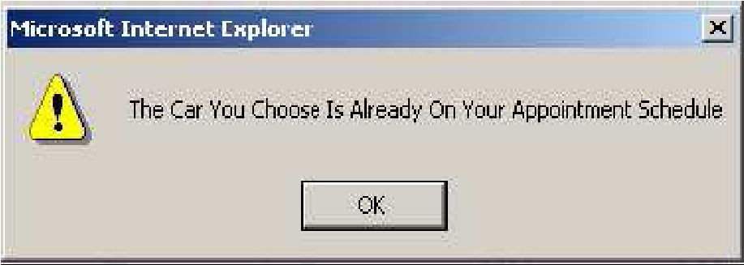

>   **PENJUALAN MOBIL BERBASIS WEB DAN MANAJEMEN DATA**

>   **PEMBAYARAN DI SHOWROOM MOBIL XYZ**

Joko Lianto Buliali 
====================

>   Jurusan Teknik Informatika, Institut Teknologi Sepuluh Nopember (ITS)
>   e-mail: *joko\@its-sby.edu*

Andreas Handojo, Frica Salim Wiharjo 
=====================================

>   Fakultas Teknologi Industri, Jurusan Teknik Informatika, Universitas Kristen
>   Petra e-mail: *handojo\@peter.petra.ac.id*

>   **ABSTRAK**: Penelitian ini bertujuan untuk mengembangkan suatu sistem
>   showroom virtual pada suatu showroom mobil sehingga dapat dilakukan
>   pemasaran dan penjualan mobil disertai dengan informasi pembayaran
>   customernya melalui Web. Sistem dikembangkan berdasarkan kebutuhan pengguna
>   terhadap sistem dan prosedur penjualan pada showroom tersebut saat ini. Dari
>   hasil tersebut, dilakukan analisis, desain, dan implementasi sistem yang
>   dibutuhkan. Uji coba terhadap sistem yang dibuat menunjukkan bahwa sistem
>   yang dibuat sudah memiliki seluruh fasilitas yang dibutuhkan pengguna
>   sistem.

>   **Kata kunci:** showroom virtual, pemasaran, penjualan mobil.

>   *ABSTRACT: The purpose of this research is to build a virtual showroom for a
>   car showroom company which allows company to do marketing, selling, and
>   providing payment information through Web. The system is developed based on
>   the requirements of the users and current selling procedure in the showroom.
>   From the investigation result, analysis, design, and implementation are
>   carried out. Testing on the system shows that the system has fulfilled all
>   the requirements needed by the users of the of the system*

*Keywords: virtual showroom, marketing, car selling.*

PENDAHULUAN 
============

>   Penjualan mobil yang dilakukan oleh *Showroom* Mobil XYZ (sebuah *Showroom*
>   Mobil di Surabaya yang tidak ingin dipublikasikan namanya) merupakan
>   penjualan berbagai macam jenis mobil bekas. Mobil yang diletakkan di
>   *showroom* tersebut kurang lebih hanya sepuluh karena adanya keterbatasan
>   tempat. Walaupun demikian, *showroom* masih dapat membantu pencarian mobil
>   yang diinginkan oleh *customer* karena adanya jalur kerjasama yang luas.
>   Prioritas utama penjualan mobil adalah mobil yang ada di *showroom*.

>   Kegiatan pemasaran yang dilakukan selama ini merupakan pemasaran yang hanya
>   mengandalkan lokasi yang strategis dan kenalan-kenalan dekat. Pemilik
>   tersebut ingin melakukan perubahan cara pemasaran dengan lebih memasarkan
>   mobilnya keluar dan meningkatkan penjualan. Untuk itu pada penelitian ini
>   dikembangkan suatu sistem penjualan mobil berbasis web yang dapat memasarkan
>   penjualan mobil secara online dan mengatur data pembayaran *customer*.

>   Fungsi utama *website* ini adalah untuk memperluas pemasaran dan
>   meningkatkan penjualan mobil. *Customer* dapat memper-oleh informasi
>   mengenai spesifikasi mobil yang diinginkan secara detail hanya dengan
>   browsing pada *website* ini. Karena salah satu keunggulan penggunaan
>   *website* adalah untuk menjangkau *customer* yang berada di daerah yang jauh
>   dari tempat fisik suatu usaha/ organisasi [4]. *Showroom* juga dapat
>   memasukkan informasi mengenai spesifikasi-spesifikasi mobil sedetil mungkin
>   ke dalam *website*-nya.

Ruang lingkup penelitian dibatasi pada pengembangan *website* untuk keperluan
*Showroom* Mobil XYZ. Dalam hal admisnistrasi pembayaran, aspek yang dapat
dibantu dengan *website* ini meliputi penyajian informasi pembayaran yang telah
dilakukan *customer*. Proses bisnis selanjutnya (seperti pelayanan purna jual)
tidak termasuk dalam lingkup penelitian ini.

Tujuan penelitian ini adalah menghasilkan sebuah *website* yang dapat menjadi
sarana pemasaran mobil *Showroom* XYZ (*virtual showroom*). Fasilitasfasilitas
yang diperlukan dalam *website* ini adalah:

1.  Halaman Pemasaran

| **31**  |
|---------|

>   Fasilitas ini digunakan untuk mengakses informasi mengenai harga dan
>   spesifikasi mobil yang diinginkan oleh *customer*. *Customer* dapat
>   melakukan pencarian mobil secara umum berdasarkan jenis-jenis mobil yang
>   disediakan atau dengan fasilitas pencarian mobil yang disesuaikan dengan
>   budget yang dimilikinya. *Customer* dapat memilih mobil yang diinginkan dan
>   memasukkannya ke dalam *Shopping Cart*.

1.  *Shopping Cart*

>   Fasilitas ini menyediakan kalkulasi pembayaran secara kredit. Bila
>   *customer* memasukkan jumlah uang muka yang akan dibayar dan lama angsuran
>   yang diinginkan, sistem menampilkan pembayaran yang harus dilakukan
>   selanjutnya. Selain itu juga menyediakan form penjualan yang berisi data
>   mobil yang diinginkan oleh *customer* dan jadwal *appointment* antara
>   *customer* dengan pihak *Showroom*, untuk melihat mobil yang diinginkan
>   *customer*. Form ini akan muncul jika *customer* sudah memiliki *login* dan
>   *password* untuk melakukan pembelian.

>   Fasilitas ini juga menyediakan form konfirmasi. Setelah *customer* melihat
>   mobil yang ingin dibelinya dan memutuskan untuk membelinya, maka *customer*
>   akan memberikan konfirmasi kepada bagian *order*.

1.  *Login* dan *Password*

>   Untuk *customer* yang ingin membeli, disediakan form *account* untuk diisi
>   supaya data *customer* dapat disimpan oleh perusahaan. Fasilitas ini
>   nantinya akan digunakan *customer* untuk dapat masuk dalam proses pembelian
>   mobil. Selain itu *customer* dapat juga mengetahui tanggal pembayaran yang
>   harus dilakukan beserta konfirmasi apakah perusahaan sudah menerima
>   pembayaran tersebut atau belum.

>   Untuk bagian yang menerima *order*, setelah *login* dilakukan, dapat
>   ditampilkan data *customer* yang melakukan pembelian, mobil yang diinginkan,
>   dan harga yang disetujui. Bagian ini juga memberikan akses *login* dan
>   *password* kepada *customer*.

>   Untuk bagian *operator*, setelah *login* dilakukan, dapat dilakukan *update*
>   jenis mobil yang dijual. *Update* bisa berupa penambahan mobil yang dijual
>   beserta harga dan spesifikasinya, mengganti harga dan spesifikasi mobil, dan
>   menghapus mobil yang telah laku. Bagian ini juga mengatur konfirmasi kepada
>   *customer* mengenai penerimaan pembayaran dan pengiriman mobil yang telah
>   dilakukan. Dapat dikatakan bahwa *operator* sekaligus berfungsi sebagai
>   *administrator*.

>   Batasan masalah dalam penelitian ini adalah bahwa proses pembayarannya
>   dilakukan secara manual, yaitu bahwa pembayaran dilakukan secara tunai,
>   transfer lewat rekening bank, atau cara lain yang tidak melalui *website*
>   yang dibuat. Pada *website* hanya dicantumkan data pembayaran yang telah
>   dilakukan *customer*.

DESAIN SISTEM 
==============

Pada saat ini *Showroom* XYZ memiliki tiga proses bisnis yang diterapkan pada
saat melayani *customer*. Proses bisnis tersebut adalah: Sistem penjualan,
Sistem Registrasi, Sistem pengiriman, dan Sistem pembayaran.

Desain Sistem Penjualan Mobil 
==============================

Proses dimulai pada saat *customer* browsing dalam *website* dan hendak
melakukan pembelian mobil. Bila *customer* ingin membeli mobil maka *customer*
diharuskan telah mempunyai *account* supaya dapat mengisi form pembelian. Bila
belum memiliki *account* maka *customer* dapat melakukan proses registrasi. Form
pembelian yang telah diisi akan menentukan jadwal *appointment* antara
*customer* dengan *showroom* untuk melihat mobil. Bila *appointment* telah
dilakukan maka *customer* diinformasikan untuk mengisi form konfirmasi bila
*customer* jadi membeli mobil. Bila *customer* telah mengisi form pembelian dan
belum melakukan *appointment* maka akan diaturkan lagi jadwal *appointment*
dengan pihak *Showroom*. Form konfirmasi akan diterima oleh bagian *order* baru
kemudian diberikan kepada *operator* sebagai data penjualan. Terjadinya
penjualan akan menyebabkan *operator* melakukan *update* data mobil supaya
didapatkan informasi yang terbaru. Desain sistem penjualan mobil dalam *website*
dapat dilihat pada Gambar 1.

>   [./media/image1.png](./media/image1.png)

**Gambar 1. Desain Sistem Penjualan Mobil pada Website**

[./media/image2.png](./media/image2.png)
========================================

Desain Proses Registrasi

Proses dimulai pada saat bagian *order* memberikan informasi untuk mengisi form
*account*. Form *account* yang telah diisi oleh *customer* akan diterima oleh
bagian *order* supaya bagian *order* dapat memberikan *username* dan *password*
kepada *customer*.

>   Desain proses registrasi dapat dilihat pada Gambar 2.

Gambar 3. Desain Sistem Pengiriman Mobil pada *Website* Desain Sistem Pembayaran 
=================================================================================

Proses dimulai pada saat *customer* memberikan bukti pembayaran yang telah
dilakukan kepada *operator*. Bukti pembayaran tersebut dicatat dalam transaksi
penjualan sebagai pernyataan bahwa pem-

Gambar 2. Desain Proses Registrasi pada *Website* Desain Sistem Pengiriman Mobil 
=================================================================================

Proses dimulai pada saat bagian *order* memberikan informasi mengenai pengiriman
mobil kepada *customer* dan *operator*. *Customer* akan menerima mobil yang
dikirim oleh *operator* dan akan memberikan tanda bukti penerimaan mobil. Tanda
bukti tersebut akan diterima oleh *operator* dan *operator* akan melakukan
*update* data pengiriman. Data pengiriman yang telah di *update* akan diberikan

kepada bagian *order*. Desain sistem pengiriman

mobil dapat dilihat pada Gambar 3. **Gambar 4. Desain Sistem Pembayaran pada**

**Website**

Desain ERD 
===========

ERD physical yang dirancang dapat dilihat pada Gambar 5.

Gambar 5. ERD Physical 
=======================

Entitas *Customer* menyimpan data *customer*. Entitas *Sales* menyimpan
penjualan yang terjadi. Entitas *Payment* menyimpan data pembayaran yang akan
dilakukan *customer*. Entitas *Car* menyimpan spesifikasi mobil secara lengkap.
Entitas *Monthly\_ payment* menyimpan data pembayaran yang dilakukan tiap bulan.
Entitas *Add\_to\_cart* menyimpan tanggal dan jumlah mobil yang dimasukkan ke
dalam *shopping cart*. Entitas *Appointment* menyimpan jadwal *appointment*
antara *customer* dengan pihak *Showroom* beserta perkiraan pembelian secara
tunai atau kredit. Entitas *Credit* menyimpan suku bunga kredit mobil. Entitas
*Color* menyimpan kode dan warna mobil. Entitas *Administrator* menyimpan data
bagian *order* dan *operator*.

Desain Database 
================

Berdasarkan desain Physical ERD, berikut adalah tabel-tabel yang digunakan:

-   Tabel *Customer*, menyimpan data *customer*. Field-field pada tabel ini
    adalah *Username, Password, Access, Name, Address, Phone, Zip, City, dan
    Country*.

-   Tabel *Sales*, menyimpan penjualan yang terjadi. Field-field pada tabel ini
    adalah *Ord\_no, Username,* dan *Ord\_date*. *Ord\_no* menyimpan nomor
    penjualan dan *Ord\_dat* menyimpan tanggal penjualan.

-   Tabel *Payment*, menyimpan data pembayaran yang akan dilakukan *customer*.
    Field-field pada tabel ini adalah *Payment\_ID, Car\_ID, Ord\_no, Price\_DP,
    DP\_Payment\_Date, Long\_Credit, Tipe\_Pay, Monthly\_Payment,
    Payment\_Statue, Send\_Car\_Date,* dan *Apt\_Date\_Time*.

-   Tabel *Car*, menyimpan spesifikasi mobil secara lengkap. Field-field pada
    tabel ini adalah *Car\_ID, Foto, Merk, Type, Year, Price, Color, T\_body,
    Kompresi, Cc, Km, Power\_steer, Transmisi, Jml\_gear, Tape, Ac, Pwr\_wdw,
    Sb\_dpn, Sb\_blkg, Kursi\_blkg, Ban*, dan *Information*.

-   Tabel *Appointment*, menyimpan jadwal *appointment* antara *customer* dengan
    pihak *Showroom* beserta perkiraan pembelian secara tunai atau kredit.
    Field-field pada tabel ini adalah *Username, Car\_ID, Apt\_Date\_Time,
    Payment\_Type, Lama\_ Credit,* dan *DP*.

-   Tabel *Monthly\_Payment*, menyimpan data pembayaran yang dilakukan tiap
    bulan. Field-field pada tabel ini adalah *Monthly\_Payment\_Date,
    Payment\_ID,* dan *Amount*.

-   Tabel *Administrator*, menyimpan data bagian *order* dan *operator*.
    Field-field pada tabel ini adalah *Username*, *Password*, dan *Access*.

-   Tabel *Credit*, menyimpan suku bunga kredit mobil. Field-field pada tabel
    ini adalah *Status, DP\_min, Lama, Bunga, Admin,* dan *Ins*.

-   Tabel *Color*, menyimpan kode dan warna mobil.

Field-field pada tabel ini adalah *ID* dan *Warna*.

Desain Data Flow Diagram (DFD) 
===============================

>   Aliran data dalam sistem yang dirancang

>   ditunjukkan dengan DFD.

DFD Level 0 
------------

Dalam DFD level 0 ini, terdapat suatu proses yang menggambarkan sistem penjualan
mobil dan aliran data yang terjadi secara garis besar. DFD level 0 dapat dilihat
pada Gambar 6. Entitas yang terlibat dalam sistem penjualan mobil meliputi
*Customer*, Bagian *Order*, dan *Operator*

Gambar 6. DFD Level 0 
======================

DFD Level 1 
------------

Pada DFD level 1 terdapat empat proses, yaitu: proses penanganan pencarian
mobil, proses penanganan pemesanan mobil, proses penanganan pembayaran, dan
proses penanganan pengiriman. DFD level 1 ada pada Gambar 7.

>   [./media/image23.png](./media/image23.png)

Gambar 7. DFD Level 1 
======================

>   Dalam Proses Penanganan Pencarian Mobil,

>   *customer* melakukan pencarian mobil yang diinginkan sampai mendapatkan
>   informasi-informasi yang diperlukan. Mobil yang dicari hanya berdasarkan
>   pada data mobil yang sudah di *update* oleh *operator*.

Dalam Proses Penanganan Pemesanan Mobil, *customer* memasukkan *username* dan
*password* beserta datanya untuk disimpan dalam data store *customer*.
*Username* dan *password* tersebut dapat digunakan untuk masuk dalam proses
pembelian mobil lebih lanjut.

Dalam Proses Penanganan, bagian *order* memberikan data pembayaran yang harus
dilakukan kepada *customer* supaya *customer* dapat melakukan pembayaran.
Pembayaran yang telah dilakukan oleh *customer* akan diterima oleh *operator*.
Setelah *operator* menerima pembayaran, baru akan melakukan *update* data
pembayaran. Data pembayaran yang telah di-*update* akan disimpan dalam data
store *monthly\_payment* perusahaan dan akan dikirimkan ke bagian *order*
sebagai arsip.

Dalam Proses Penanganan Pengiriman, bagian *order* memberikan data pengiriman
mobil kepada *customer* dan *operator*. *Operator* yang akan melakukan
pengiriman mobil kepada *customer*. Setelah *customer* menerima mobil, maka
*customer* akan memberikan tanda bukti penerimaan mobil kepada *operator*. Tanda
bukti yang telah diterima oleh *operator* akan dikirimkan kepada bagian *order*
sebagai tanda bahwa mobil telah terkirim dan akan disimpan ke dalam data store
*payment*.

DFD Level 2 Proses Penanganan Pencarian Mobil (pada Gambar 8) memiliki tiga
proses, yaitu: proses yang melakukan *update* mobil, proses yang melakukan
pencarian mobil berdasarkan budget atau manual, dan proses yang melakukan
perhitungan kredit.

**Gambar 8. DFD Level 2 Proses Penanganan**

Pencarian Mobil 
================

Perhitungan kredit dilakukan bila *customer* telah memberikan data *down
payment* yang akan diberikan dan lama kredit yang diinginkan. Proses ini
menghasilkan jumlah angsuran tiap bulan yang harus dibayar oleh *customer*
dengan perumusan seperti pada Segmen Program 1. Sisa = Harga cash mobil - Down
payment Credit = Credit rate \* Sisa

>   Insurance = Insurance rate \* Sisa

>   Total Credit = Sisa + Credit + Adm fee + Insurance Monthly payment = Total
>   Credit / months

>   First Payment = Down payment + Monthly payment

>   Segmen Program 1. Perhitungan Kredit

>   Data Harga cash mobil *Down payment* mini-

>   mum, Credit rate, Insurance rate, Adm fee ada pada Tabel Car dan Tabel
>   Credit yang telah diuraikan pada bagian desain database.

*DFD Level 2 Proses Yang Menangani Pemesanan*

Mobil 
------

>   Pada DFD level 2 proses penanganan peme-

>   sanan mobil terdapat tiga proses, yaitu: proses yang menangani registrasi,
>   proses yang menangani pembelian dan proses yang melakukan pengambilan. DFD
>   level 2 proses penanganan pemesanan mobil dapat dilihat pada Gambar 9.

**Gambar 9. DFD Level 2 Proses Penanganan**

Pemesanan Mobil 
================

Dalam subproses Penanganan Registrasi, *customer* memasukkan *username* dan
*password* beserta datanya untuk disimpan di data store *customer*. Bila
*username* yang dipilih telah terpakai, maka *customer* diharuskan memasukkan
*username* yang lain. Isi *password* dan *re-enter password* harus sama.

*Proses Penanganan Pembelian Mobil*

Dalam subproses ini, *customer* melakukan pemesanan mobil yang kemudian disimpan
ke dalam data store *add\_to\_cart* dan bagian *order* akan memberikan jadwal
*appointment*. Jadwal yang sudah dipilih akan disimpan pada data store
*appointment*. Bila *customer* memutuskan membeli mobil setelah melakukan
*appointment*, maka konfirmasi pembelian mobil dapat dikirimkan kepada bagian
*order*. Bagian *order* menyimpan konfirmasi pembelian itu ke dalam data store
*sales dan payment*.

*Proses Penanganan Pengambilan*

Dalam proses ini, *username* dan *password* beserta data *customer* diambil dari
data store *customer* untuk dijadikan arsip pada bagian *order* bila terjadi
penjualan.

Desain Peta *Website* 
======================

>   Peta *website* yang dirancang ada pada Gambar

>   10. Simbol hak akses pengguna adalah:

1.  C = *Customer*

2.  BO = Bagian *Order*

3.  O = *Operator*

Gambar 10. Peta *Website* 
==========================

Menu yang muncul pada setiap halaman web berbeda-beda sesuai hak akses pengguna.
Menu dibedakan menjadi 4 (empat) macam, yaitu:

1.  *Menu Umum*, dapat diakses oleh semua pengguna. Bagian dari menu ini adalah:

    -   *Home*, menampilkan halaman home yang juga merupakan halaman yang
        pertama kali ditampilkan saat *website* diakses.

    -   *Sign-up*, menampilkan halaman registration form yang dapat diakses oleh
        *customer* untuk registrasi *user*.

    -   *Car Product*, menampilkan halaman *car product* yang berisi jenis-jenis
        mobil dan spesifikasinya.

    -   *Search*, menampilkan halaman *search* yang berupa form untuk mencari
        mobil sesuai dengan spesifikasi yang ada.

2.  Menu *Customer*

>   Menu ini hanya dapat diakses oleh *customer* yang telah mempunyai *login*.
>   Bagian dari menu ini adalah:

-   *Payment Detail*, menampilkan halaman payment detail yang berisi data
    pembayaran dan data penerimaan mobil.

-   *User Detail*, menampilkan halaman user detail yang berisi data pribadi
    *customer*.

-   *Car Product*

-   *Search*

-   *Shopping Cart*, menampilkan halaman yang berisi mobil-mobil yang diinginkan
    *customer*.

-   *Log out*

1.  Menu Bagian *Order*

>   Menu ini hanya dapat diakses oleh bagian *order*.

>   Bagian dari menu ini adalah:

-   *Purchase Confirmation*, menampilkan halaman purchase confirmation yang
    berisi jadwal *appointment* dan list mobil yang ingin dipesan *customer*.

-   *Sales Report*, menampilkan halaman *sales report* yang berisi data
    penjualan yang terjadi.

-   *Change Password*, menampilkan halaman *change password* yang berisi
    *username* dan *password* serta form untuk mengganti *password*.

-   *Sign-up*, menampilkan halaman registration form yang dapat diakses oleh
    bagian *order* dan *operator*.

-   *Log Out*

1.  Menu *Operator*

>   Menu ini hanya dapat diakses oleh *operator*. Bagian dari menu ini adalah:

-   *Car Product*, menampilkan halaman *car product* yang berisi daftar semua
    jenis mobil yang dijual.

-   *Credit Rate*, menampilkan halaman credit rate yang berisi form-form untuk
    mengganti suku bunga kredit.

-   *Payment & Sent*, menampilkan halaman *payment & sent* yang berisi form
    pembayaran untuk memasukkan jumlah pembayaran yang telah dilakukan oleh
    *customer* setiap bulannya.

-   *Change Password*, menampilkan halaman change *password* yang berisi
    *username* dan *password* serta form untuk mengganti *password*.

-   *Sign-up* • *Log out*

Halaman-halaman yang dirancang adalah sebagai berikut:

-   Halaman *Home*, merupakan halaman yang pertama kali ditampilkan saat
    pengguna mengakses sistem.

-   Halaman *Registration Form*, digunakan untuk melakukan registrasi data
    *customer*, bagian *order*, dan *operator*.

-   Halaman *Car Product*, menampilkan jenis-jenis mobil beserta spesifikasinya.
    Halaman ini dapat diakses oleh setiap *customer* tetapi hanya *customer*
    yang mempunyai *account* yang dapat melakukan pembelian.

-   Halaman *Calculation of Credit*, dapat diakses oleh siapa saja dan dapat
    digunakan untuk melakukan perhitungan kredit mobil sesuai dengan suku bunga
    yang telah disediakan.

-   Halaman *Search*, digunakan untuk melakukan pencarian mobil berdasarkan
    spesifikasi atau budget.

-   Halaman *Payment Detail*, merupakan halaman yang bisa diakses oleh
    *customer* dengan datanya masing-masing. *Customer* dapat melakukan
    pengecekan data pembayaran dan pengiriman mobil. Data pembayaran yang
    disediakan berupa data pembayaran yang harus dilakukan, data pembayaran yang
    sudah dilakukan, dan data pembayaran yang belum dilakukan. Data pengiriman
    mobil berupa tanggal pengiriman mobil.

-   Halaman *User Detail*, merupakan halaman yang menampilkan data pribadi
    *customer*. Data yang ditampilkan adalah *username*, *password*, name,
    address, phone number, zip code, city/town, dan country. *Customer* dapat
    melakukan perubahan pada data pribadinya dengan menekan tombol

>   *Edit*.

-   Halaman *Edit Data Customer*, merupakan halaman yang digunakan oleh
    *customer* untuk melakukan *update* data pribadi. Cara kerja halaman ini
    hampir sama dengan halaman registration form tetapi pada halaman ini
    *customer* tidak diperbolehkan mengganti *username*. *Customer* hanya boleh
    mengganti: *password*, name, address, phone number, dan zip code.

-   Halaman *Shopping Cart*, hanya bisa diakses oleh *customer* yang telah
    mempunyai *account*. Pada halaman ini *customer* dapat melihat jadwal
    *appointment* yang sudah ada serta dapat melihat list mobil yang telah
    dipilihnya untuk dibeli. Ada dua cara untuk masuk ke dalam halaman ini,
    yaitu pada saat *customer* melakukan click pada menu *shopping cart* dan
    pada saat *customer* memasukkan mobil yang dipilihnya ke dalam *cart* dengan
    melakukan click pada link *Add to Cart* yang terdapat pada halaman *car
    product*.

-   Halaman *Purchase Form*, merupakan halaman yang akan diakses oleh *customer*
    dari link pada kolom buy di halaman *shopping cart* bila *customer* ingin
    melakukan pembelian. Pada halaman ini, *customer* menentukan tanggal
    pertemuan dengan pihak *Showroom* beserta perkiraan pembayaran yang akan
    dilakukan.

-   Halaman *Purchase Confirmation*, merupakan halaman yang hanya bisa diakses
    oleh bagian *order*. Bagian *order* akan menentukan jadi tidaknya *customer*
    melakukan pembelian berdasarkan konfirmasi yang diterima dari *customer*.
    Pada saat bagian *order* hendak menentukan pilihan, ada dua kemungkinan yang
    akan dilakukan bagian *order*, yaitu:

1.  Menyatakan mobil tidak jadi dibeli. Bila mobil tidak jadi dibeli maka akan
    dilakukan penghapusan data pada tabel *appointment*.

2.  Menyatakan mobil jadi dibeli. Bila mobil jadi dibeli maka akan dilakukan:
    Generate pada id mobil dan tanggal pembelian, Pemberian tanda pada mobil
    yang terjual dengan melakukan *update* informasi mobil pada tabel car,
    Penghapusan data dari tabel *appointment*.

-   Halaman *Edit Purchase Form*, merupakan halaman yang hanya bisa diakses oleh
    bagian *order*. Pada halaman ini, bagian *order* dapat melakukan perubahan
    pada tipe pemba-yaran, lama kredit, dan jumlah *down payment* sesuai dengan
    konfirmasi yang diberikan oleh *customer*.

-   Halaman *Sales Report*, digunakan oleh bagian *order* untuk menampilkan data
    penjualan yang terjadi. Pencarian dilakukan berdasarkan tanggal penjualan
    yang terjadi dan status pembayaran yang lunas atau belum.

-   Halaman *Change Password*, dapat diakses oleh bagian *order* atau *operator*
    untuk melakukan perubahan *password*.

-   Halaman *Product*, hanya bisa diakses oleh *operator*. Pada halaman ini
    ditampilkan semua jenis mobil yang dijual. *Operator* yang akan melakukan
    *edit*, *delete*, dan *add* pada jenis-jenis mobil dan warna. Perubahan data
    mobil dilakukan pada halaman *edit product*. Penambahan jenis-jenis mobil
    dilakukan pada halaman *add product*.

-   Halaman *Edit Product*, merupakan halaman yang digunakan oleh *operator*
    untuk melakukan perubahan data mobil. Semua data mobil dapat diubah kecuali
    car id. Perubahan terhadap semua data dapat dilakukan terlebih dahulu tetapi
    perubahan pada foto *product* hanya bisa dilakukan pada halaman *upload*
    foto.

-   Halaman *Add Product*, merupakan halaman yang digunakan oleh *operator*
    untuk melakukan penambahan jenis mobil beserta spesifikasinya.

-   Halaman *Upload Foto*, merupakan halaman yang digunakan oleh *operator*
    untuk melakukan perubahan data foto.

-   Halaman *Credit Rate*, hanya dapat diakses oleh *operator* untuk melakukan
    perubahan terhadap suku bunga *down payment* minimum, suku bunga kredit,
    biaya administrasi per tahun, dan suku bunga asuransi per tahun.

-   Halaman *Payment & Sent*, hanya dapat diakses oleh *operator* untk
    menampilkan data mobil yang telah dikirim dan untuk melakukan *update* data
    pembayaran yang telah dilakukan oleh *username* setiap bulan.

*Platform* yang digunakan dalam pembuatan sistem ini adalah:

-   *Active Server Pages (ASP)*, karena kesesuaiannya untuk *e-commerce* [2]

-   MySQL, karena kesederhanaan dan kecepatannya

>   [1]

-   Macromedia Dreamweaver MX, karena fleksibilitas pemrogramannya [3]

-   IIS *Web Server*

PENGUJIAN 
==========

Pengujian dilakukan untuk mengetahui sampai sejauh mana sistem ini dapat
berfungsi dengan baik sesuai dengan semestinya. Pengujian yang dilakukan
membutuhkan seperangkat komputer dengan sejumlah software. Berikut spesifikasi
komputer dan software yang digunakan: - *Processor*: Intel Pentium III 500 MHz

-   *Memory*: 192 MB

-   *Storage/hard disk*: 10 GB

-   Sistem Operasi: Windows 2000 - *Web Server*: Microsoft IIS

-   *Browser*: Internet Explorer 6.0

Pengujian dilaksanakan dengan melakukan semua proses dalam sistem yang memiliki
tiga jenis pengguna (*customer*, bagian *order*, dan *operator*), yaitu:

1.  Pengujian *login*

2.  Pengujian *registration form*

3.  Pengujian pada halaman *car product* sesudah

>   *customer* melakukan *login*

1.  Pengujian *calculation of credit*

2.  Pengujian *search*

3.  Pengujian *payment detail*

4.  Pengujian *edit data customer*

5.  Pengujian halaman *shopping cart*

6.  Pengujian *purchase form*

7.  Pengujian *purchase confirmation*

8.  Pengujian *edit purchase form*

9.  Pengujian *sales report*

10. Pengujian *change password*

11. Pengujian *product*

12. Pengujian *edit product*

13. Pengujian *add product*

14. Pengujian *upload foto*

15. Pengujian *payment & sent*

16. Pengujian *credit rate*

17. Pengujian *log out*

Dari semua pengujian yang telah dilakukan, dapat disimpulkan bahwa sistem web
yang dibuat telah berfungsi seperti yang dibutuhkan oleh pengguna sehingga siap
dipergunakan oleh *Showroom* XYZ untuk melakukan pemasaran dan penjualan mobil.

Apabila pengguna tidak mengisikan isian yang harus diisikan pada field-field
pada *registration form* yang harus terisi, maka sistem memberikan peringatan.

Apabila pengguna memasukkan *username* yang ternyata sama dengan *username* yang
telah ada pada tabel *customer*, maka sistem memberikan peringatan seperti
Gambar 11. *Window* peringatan serupa juga muncul apabila pengguna mengisi
*password* yang berbeda dengan *re-enter password*.

Gambar 11. Peringatan *Username* 
=================================

Apabila mobil yang dipilih ternyata sudah masuk dalam jadwal *appointment*, maka
muncul peringatan seperti pada Gambar 12.

Gambar 12. Peringatan *Appointment* 
====================================

Apabila pengguna berusaha memasukkan mobil yang telah terjual ke dalam *cart*,
maka muncul peringatan seperti pada Gambar 13.

Gambar 13. Peringatan Mobil Terjual 
====================================

Apabila pengguna sudah pernah memasukkan suatu mobil ke dalam *cart* dan
berusaha memasukkannya lagi, maka akan muncul peringatan seperti pada Gambar 14.

Gambar 14. Peringatan Pemasukan Mobil Pengujian Calculation of Credit 
======================================================================

Gambar 15 menunjukkan perhitungan kredit untuk Suzuki Baleno tahun 1997 dengan
harga Rp. 84.000.000,- mempunyai *down payment* minimum 15% dari harga mobil.
Untuk melakukan kalkulasi perhitungan, dilakukan pengisian *down payment*
melebihi jumlah *down payment* minimum tetapi tidak melebihi harga mobil dan
lama kredit adalah satu tahun.

Gambar 15. Pengisian *Down Payment* (1) 
========================================

Gambar 16 menunjukkan hasil perhitungan untuk mobil Suzuki Baleno tahun 1997
bila *down payment* diisi lebih besar dari *down payment* minimum dan tidak
melebihi harga mobil. Lama kredit diisi satu tahun.

Gambar 16. Pengisian *Down Payment* (2) 
========================================

Bila *customer* melakukan pengisian jumlah *down payment* lebih kecil dari
jumlah *down payment* minimum seperti pada Gambar 17 atau mengisi lebih besar
dari harga mobil, maka pada saat tombol *calculate* ditekan akan menghasilkan
perhitungan seperti pada Gambar 18.

1.  [./media/image31.png](./media/image31.png)

    Sistem dapat digunakan untuk memasukkan data mobil yang dijual, mengubah
    data mobil yang ada, dan menghapus data mobil yang telah terjual.

2.  Sistem dapat digunakan untuk melakukan penjualan mobil.

3.  Sistem dapat digunakan untuk mengatur data penjualan mobil yang terjadi,
    data pengiriman **Gambar 17. Pengisian Down Payment (3)** mobil yang akan
    dilakukan, dan data pembayaran.

Secara keseluruhan, dapat disimpulkan sistem

>   [./media/image32.png](./media/image32.png)

>   telah dapat berfungsi sebagai sebuah *virtual showroom* bagi *Showroom*
>   Mobil XYZ.

DAFTAR PUSTAKA 
===============

1.  \---------, Server Configuration, IndoGlobal, http://
    intl.indoglobal.com/whitepaper/server/, 2004.

2.  \---------, e-Logistics in Japan, Embassy of Finland, Tokyo, Japan.
    *http://websrv2.tekes.fi/opencms/
    opencms/OhjelmaPortaali/Kaynnissa/ELO/en/Do*

>   *kumenttiarkisto/Viestinta\_ja\_aktivointi/Esitysaine* **Gambar 18.
>   Pengisian Down Payment (4)** 3. *isto/ELO\_Japan.doc*Agung, Gregorius, ,
>   2004. *Pemrograman ASP dengan Dreamweaver MX. Jakarta*. PT. Elex Media

Pengecekan juga dilakukan bila field *down* Komputindo, 2003.

>   *payment* diisi bukan numerik. Bila field *down pay-* 4. Turban, E., D.
>   King; J. Lee, M. Warkentin, H.M. *ment* diisi bukan numerik maka muncul
>   peringatan Chung, *Electronic Commerce: A Managerial* seperti pada Gambar
>   19. *Perspective (2nd ed.).* New Jersey. Prentice-Hall,

Inc. 2000.

Gambar 19. Peringatan Isian Non Numerik KESIMPULAN 
===================================================

Dari pembuatan dan pengujian sistem diatas, dapat diambil kesimpulan berikut:

1.  Sistem telah dapat digunakan untuk menampung data *customer* serta *login*
    dan *password*.

2.  Pengguna dapat memperoleh informasi mengenai mobil yang dijual melalui
    internet kapan saja dan di mana saja.

3.  Sistem dapat menghitungan kredit mobil sesuai dengan jumlah *down payment*
    dan lama pembayaran yang ditentukan pengguna.l

4.  Sistem dapat memberikan fasilitas bagi user untuk mengatur jadwal
    *appointment* dengan pihak *Showroom*.
