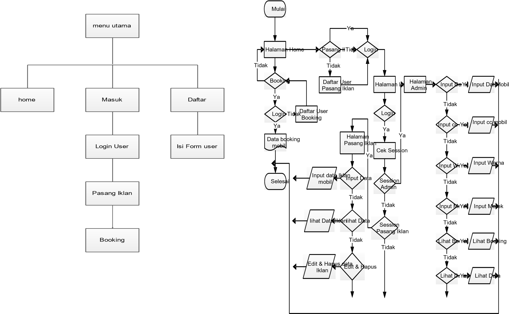
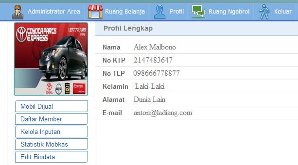
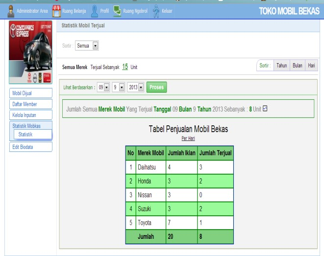
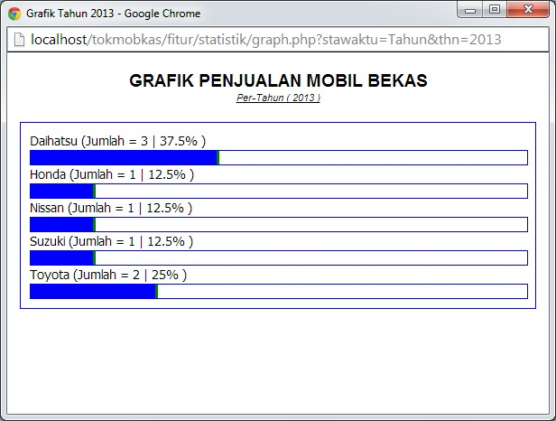
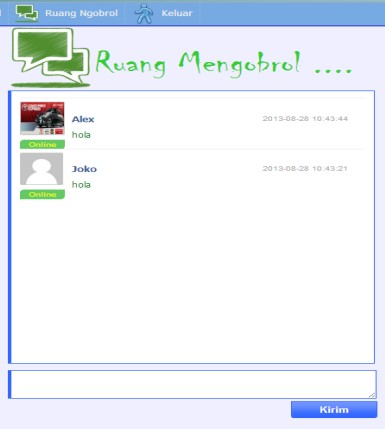
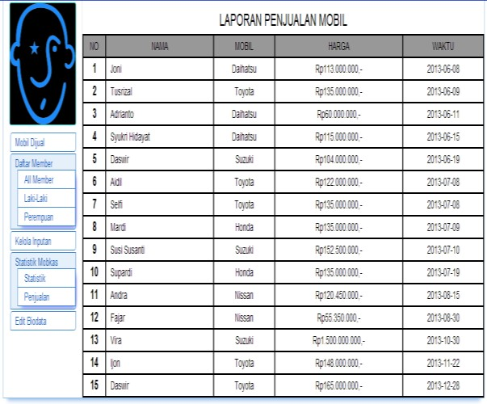

>   **PERANCANGAN APLIKASI PENJUALAN MOBIL BEKAS**

>   **DI CV. SHANDY MOTOR BERBASIS WEB**

**Oleh:**

**Minarni, S.Si., M.T\*), Beri Antoni\*\*)**

\*) Dosen Jurusan Teknik Informatika

\*\*) Mahasiswa Jurusan Teknik Informatika

Fakultas Teknologi Industri, Institut Teknologi Padang

*Abstrak* 
==========

*A very tight competition is currently trading world requires a good promotional
strategy. Promotional strategies to attract and reach more consumers and also to
meet the needs of consumers. CV. Shandy Motor is a car showroom that specializes
in buying and selling used cars, promotions are still using paper facility,
brochures, and other similar facilities. Barriers - the barriers that make it
less effective promotional product. Therefore, the authors researched to design
an "application design information systems web-based used car sales" to simplify
the used car market products in perjual traded in CV. Shandy Motor. And
facilitate people who want to sell his car. Application used to create
applications used car sales information system is a web-based XAMPP, MySQL. The
results of this final task is in the form of an information system used car
sales web-based web information can be used for buying and selling used cars as
a means of promotion, which will be taken into consideration for prospective
buyers.*

*Keywords: Information Systems,Used cars, Web-based XAMPP, MySQL,Web based
information*

1. Pendahuluan 
---------------

Dewasa ini perkembangan bidang teknolgi informasi sangat pesat, oleh karena itu
sudah banyak pula perusahaan, industri, pertokoan dan badan usaaha lain yang
menggunakan sistem informasi untuk meningkatkan usahanya. CV. Shandy Motor
merupakan showroom mobil yang bergerak dalam bidang jual-beli mobil bekas,
promosi yang ada masih menggunakan fasilitas kertas, brosur, dan fasilitas
lainya yang sejenis. Hambatan – hambatan tersebut yang membuat kurang efektifnya
promosi produk. Dan semakin banyaknya variasi, merek dan jenis mobil beredar
membuat para konsumen bingung untuk memilih mobil yang akan dibelinya. Hal
tersebut akan menjadi kendala bila para pelangganya yang mempunyai aktivitas
padat atau tidak memiliki waktu luang yang banyak, jika hanya sekedar melihat
produk-produk yang akan dipilih oleh konsumen di CV. Shandy Motor. Dengan
melihat persoalan yang ada, penulis menganggap perlu untuk merancang suatu
**“perancangan aplikasi penjualan mobil bekas berbasis web”** untuk mempermudah
dalam memasarkan produk mobil bekas yang di perjual belikan di CV. Shandy Motor.
Serta mempermudah orang yang ingin menjual mobilnya.

### 1.1 Rumusan Masalah 

Berdasarkan permasalahan yang dijelaskan maka perumusan masalah adalah
“Bagaimana merancang suatu aplikasi penjualan mobil bekas berbasis web untuk
mempermudah dalam mempromosikan penjualan mobil bekas di CV. Shandy Motor.

### 1.2 Batasan Masalah 

Untuk memfokuskan ruang lingkup dibatasi pada pembahasan sebagai berikut:

1.  Dalam perancangan database aplikasi sistem informasi penjualan mobil bekas
    menggunakan Mysql dan PHP sebagai bahasa program dalam perancangan web.

2.  Sistem infrmasi penjualan mobil bekas berbasis web ini hanya mempromosikan
    mobil bekas saja.

### 1.3 Tujuan Penelitian 

Tujuan penelitian ini adalah :

Merancang suatu aplikasipenjualan mobil bekas berbasis web yang dapat digunakan
untuk web informasi jual beli mobil bekas sebagai sarana promosi, yang nantinya
bisa menjadi bahan pertimbangan bagi calon pembeli.

### 1.4 Manfaat Penelitian 

Dengan dirancangnya aplikasi ini diharapkan dapat memberikan manfaat sebagai
berikut :

1.  Bagi calon pembeli, Memberikan gambaran secara umum tentang nilai mobil yang
    akan mereka beli.

2.  Bagi penjual. Memberikan gambaran secara umum mengenai selera dari calon
    pembeli. Dan sebagai media lain selain koran atau brosur, dalam mengiklankan
    mobil yang akan mereka jual.

2. Metodologi 
--------------

### 2.1 Context Diagram 

>   [./media/image1.png](./media/image1.png)

>   Gambar 1. Context Diagram

### 2.2 Rancangan Database 

Berikut ini merupakan rancangan database yang dirancang.

Tabel 1 Tabel Merek

| **Field**  | **Tipe**  | **Width**  | **Ket**     |
|------------|-----------|------------|-------------|
| Id         | Integer   | 11         | Primary key |
| Merek      | Varchar   | 20         |             |
| url\_logo  | Varchar   | 255        |             |

*Ket: Keterangan*

| **Field**  | **Tipe**  | **Width**  | **Ket**     |
|------------|-----------|------------|-------------|
| Id         | Integer   | 11         | Primary key |
| Cc         | integer   | 10         |             |

Tabel 2 Tabel Cc Mobil

| **Field**  | **Tipe**  | **Width**  | **Ket**     |
|------------|-----------|------------|-------------|
| Id         | Integer   | 11         | Primary key |
| Warna      | Varchar   | 30         |             |

Tabel 3 Tabel Warna Mobil

| **Field**  | **Tipe**  | **Width**  | **Ket** |
|------------|-----------|------------|---------|
| Id         | Integer   | 11         |         |
| Id\_mobil  | varchar   | 11         |         |
| url\_foto  | varchar   | 255        |         |

Tabel 4 Tabel Foto Mobil

| **Field**     | **Tipe**  | **Width**  | **Ket** |
|---------------|-----------|------------|---------|
| Id            | Integer   | 11         |         |
| Merek         | varchar   | 20         |         |
| Typem         | varchar   | 20         |         |
| Deafaul\_foto | varchar   | 255        |         |

Tabel 5 Tabel Type Merek

| **Field**  | **Tipe**  | **Width**  | **Ket**     |
|------------|-----------|------------|-------------|
| Id         | Integer   | 11         | Primary key |
| Username   | Varchar   | 30         |             |
| User\_p    | Varchar   | 30         |             |
| Id\_mobil  | Varchar   | 11         |             |
| Hari       | Datetime  |            |             |
| Status     | Enum      | 0,1        |             |

Tabel 6 Tabel Booking

| Alamat        | Varchar   | 255        |              |
|---------------|-----------|------------|--------------|
| Email         | Varchar   | 30         |              |
| Foto          | Foto      | 255        |              |
| Time\_singup  | Datetime  |            |              |
| **Field**     | **Tipe**  | **Width**  | **Ket**      |
| Id\_mobil     | Integer   | 11         | Primar y key |
| Nopol         | Varchar   | 10         |              |
| Merek         | Varchar   | 30         |              |
| Tahun         | Year      | 4          |              |
| Km            | Integer   | 10         |              |
| Cc            | Integer   | 10         |              |
| Warna         | Varchar   | 10         |              |
| Harga         | Varchar   | 10         |              |
| Kab\_kota     | Varchar   | 50         |              |
| Waktu         | Datetime  |            |              |
| Default\_foto | Varchar   | 255        |              |
| **Field**     | **Tipe**  | **Width**  | **Ket**      |
| Id            | Integer   | 11         | Primary key  |
| Username      | Varchar   | 30         |              |
| Pesan         | Varchar   | 255        |              |
| Waktu         | Datetime  |            |              |

>   Tabel 7 Tabel Mobkas

Tabel 11 Tabel Chat

Tabel 12 Tabel Kab\_Kota

| **Field**       | **Tipe**  | **Width**   | **Ket**      |
|-----------------|-----------|-------------|--------------|
| Id              | Integer   | 11          | Primar y key |
| Kabupaten\_kota | Varcha r  | 50          |              |
| **Field**       | **Tipe**  | **Width**   | **Ket**      |
| Id              | Integer   | 11          | Primary key  |
| User\_p         | Varchar   | 30          |              |
| Id\_mobil       | Varchar   | 11          |              |
| Status\_iklan   | Enum      | 0,1         |              |
| **Field**       | **Tipe**  | **Width**   | **Ket**      |
| Username        | varchar   | 30          | Primary key  |
| Password        | Varchar   | 32          |              |
| Lvl             | Varchar   | 1           |              |
| Status\_login   | Enum      | 0,1         |              |
| **Field**       | **Tipe**  | **Widt h**  | **Ket**      |
| Nama\_d         | Varchar   | 30          | Primary key  |
| Nama\_b         | Varchar   | 30          |              |
| No\_ktp         | Integer   | 16          |              |
| No\_tlp         | Varchar   | 12          |              |
| Kelamin         | Enum      | L,P         |              |

>   [./media/image4.png](./media/image4.png)

>   Tabel 8 Tabel Pemilik

**2.3 Rancangan Entity Relationship**

 Diagram 
=========

>   Tabel 9 Tabel Login

>   Tabel 10 Tabel User

Gambar 2. ERD

2.4 Struktur Program 
---------------------

Gambar 3. Struktur program user

Gambar 4. Struktur program admin

2.5 Flowchart Perancangan Sistem 
---------------------------------

Gambar 5. Flowchart Perancangan Sistem

User dan Admin

3. Pembahasan dan Analisa 
--------------------------

### 3.1 Penggunaan Halaman Utama 

Halaman utama merupakan tampilan awal dari aplikasi sistem informasi penjualan
berbasis *web* yang menampilkan seluruh iklan yang dipasang dan halaman utama
ini merupakan tampilan untuk melakukan proses pendaftaran untuk pemasangan iklan
bagi *user* serta melakukan *login* bagi *user* yang telah terdaftar sebagai
member untuk melakukan transaksi booking mobil dan *login* admin untuk mengelola
seluruh iklan yang masuk dan *user* yang mendaftar.

Agar dapat terkoneksi ke database digunakan fungsi *mysql\_connect()* ,
localhost sebagai alamat server ,root adalah nama pengguna dan untuk password
masih di biarkan kosong. Untuk memilih database dari server digunakan fungsi
*mysql\_selected\_db()* . *Script*

[./media/image9.jpg](./media/image9.jpg)
========================================

Mobil

Gambar 4 Tampilan Halaman Utama

>   [./media/image11.jpg](./media/image11.jpg)

>   Gambar 5 form Interface Masuk

**3.3 Penggunaan Interface Halaman**

 Pendaftaran 
=============

Untuk dapat masuk atau *login* user harus mendaftar berikut adalah tampilan form
pendaftaran member.

Gambar 8 Halaman Profil Admin

**3.6 Penggunaan Interface Halaman**

 Statistik Mobil Terjual 
=========================

Pada halaman statistik mobil terjual ini admin dapat melihat jumlah iklan secara
keseluruhan dan jumlah iklan keseluruhan yang terjual, berdasarkan hari,bulan
dan tahun berikut tampilan halaman statistik mobil terjual.

Gambar 9 Statistik Mobil Terjual

**3.7 Penggunaan Tampilan Grafik** Pada form grafik ini berfungsi untuk meliahat
statistik penjualan mobil bekas. Berikut tampilan form grafik penjualan.

Gambar 10 Tampilan Grafik Penjualan

**3.8 Penggunaan Interface Halaman**

 Ruang Ngobrol 
===============

Pada form ruang ngobrol user dapat mengirim pesan sesama *user*

Gambar 11 Ruang Ngobrol

**3.9 Analisa Kerja Pada Sistem Penjualan**

 yang Lama dan yang Baru 
=========================

Berikut ini adalah gambar penjualan

mobil bekas dengan sistem yang dirancang

Gambar 12 Laporan Penjualan Mobil

Dari sistem yang dirancang dapat memperluas jangkauan promosi mobil yang di jual
di C.V Shandy Motor dan dalam penjualan mobil bekas dapat menjual lima unit
mobil dalam perbulan. Dan jumlah pelanggan bertambah.

Dari hasil pengujian, aplikasi yang dirancang dapat mempermudah konsumen untuk
mendapatkan informasi tentang penjualan mobil bekas di C.V Shandy motor dan
mempermudah konsumen yang ingin menjual mobil.

Keuntungan dari C.V Shandy motor dalam pemasangan iklan oleh user dari website
ini adalah setelah iklan yang di promosikan laku terjual maka C.V Shandy motor
mendapat keuntungan dari iklan user yang terjual sesuai dengan kesepakatan oleh
user dan CV. Shandy motor dari penjualan mobil.

4 Kesimpulan dan Saran 
-----------------------

### 4.1 Kesimpulan 

Aplikasi penjualan mobil bekas berbasis web ini dapat memperluas jangkauan
promosi mobil yang di jual di C.V Sandi Motor dan juga mempermudah orang lain
dalam menjual dan membeli mobil bekas,

### 4.2 Saran 

Penelitian selanjutnya diharapkan dapat menambah fitur-fitur untuk pencarian dan
informasi spesifikasi mobil yang lebih spesifik. Agar website lebih mudah lagi
digunakan oleh user.

5. DAFTAR PUSTAKA 
------------------

Delvianti : 2010 *Desain dan implementasi sistem informasi permintakan pembelian
barang (studi kasus PT. semen padang ;* ITP

*Kadir, Abdul; 2008 Dasar Perancangan & Implementasi Data Base Relasional;
Yogyakarta: Penerbit Andi..*

*Kadir, Abdul; 2008 Dasar Pemograman Web Dinamis Menggunakan PHP;*

*Yogyakarta: Penerbit Andi.*

Rahardja,Untung : 2009 *Siapa Saja Bisa Membuat Website dengan CSS dan HTML*
Yogyakarta: *Penerbit Andi.*

Suhartono, dwi agung : *2007 Aplikasi sistem informasi penjualan pada gerai
(outlet) ponsel;* Universitas

>   Diponegoro
