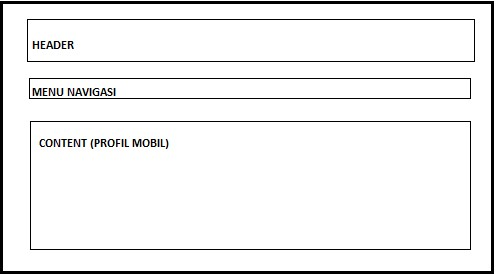
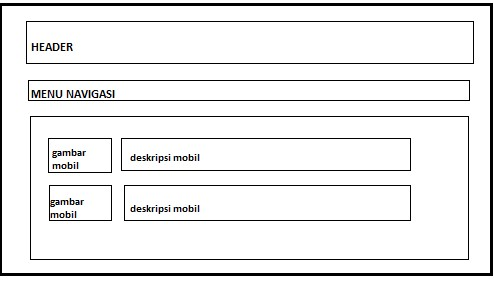
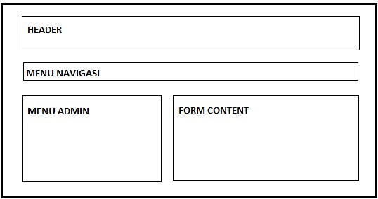
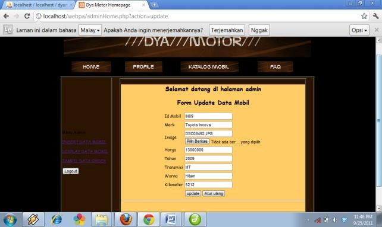
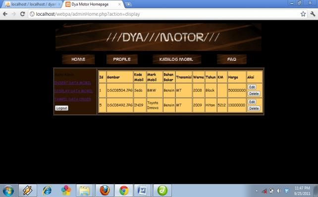
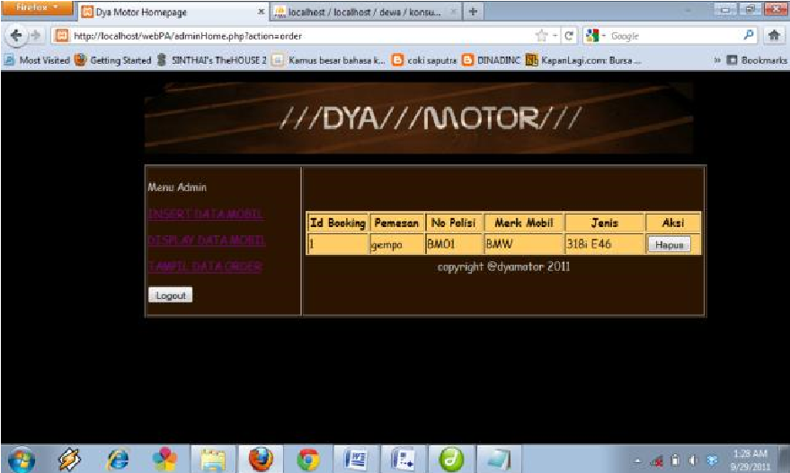

>   [./media/image1.png](./media/image1.png)

**APLIKASI PENJUALAN MOBIL BEKAS BERBASIS WEB (STUDY KASUS: DYA MOTOR)**

Dewanti Nur Sari Ahmad Suryan Awan Rimbawan

Dewanti.nur\@mi.politekniktelkom.ac.id email\@politekniktelkom.ac.id
*awn.rmb\@politekniktelkom.ac.id*

Program Studi Manajemen Informatika Politeknik Telkom Bandung 2011 
===================================================================

ABSTRAK 
========

Dya motor *Showroom* adalah perusahaan yang bergerak di bidang penjualan mobil
bekas. Perkembangan teknologi penjualan membuat perusahaan ingin memperluas
jangkauan dan memberikan kemudahan untuk customernya

Pembuatan sebuah aplikasi berbasis web yang dapat mempermudah dan keuntungan
bisnis bagi perusahaan dan customernya. Sebuah bisnis dan penjualan dapat di
lakukan dalam sebuah website agar membuat kemudahan untuk perusahaan dan
customer, misalnya customer tidak perlu lagi harus datang langsung ke *showroom*
untuk melihat mobil yang ada di *showroom.*

Proyek Akhir ini akan membangun Aplikasi penjualan Mobil bekas berbasis web pada
Dya Motor *showroom* dengan metode waterfall. Pihak perusahaan menyadari tidak
semua customernya dapat mempunyai waktu yang banyak untuk dapat datang langsung
ke *showroom* untuk itu dibangunnya website ini dapat menjadi penghubung dan
kemudahan untuk perusahaan dan customernya. **Kata Kunci: Dya Motor, website,
waterfall, Aplikasi web**

1 PENDAHULUAN 
==============

1.1 Latar Belakang 
-------------------

Pada saat ini perkembangan teknologi informasi semakin berkembang pesat. Banyak
perusahaan yang memanfaatkan teknologi informasi untuk menunjang dan
mengembangkan kinerja perusahaannya. Media *online* yang berbasis web saat ini
sedang diminati perusahaan sebagai faktor pendukung dalam mengembangkan
perusahaannya. Website salah satunya. Website digunakan sebagai media *online*
agar masyarakat lebih mudah mendapatkan informasi melalui internet.

Sebagai usaha pribadi yang baru muncul di tahun 2007 yang bergerak di bidang
penjualan mobil bekas. DYA MOTOR *showroom* yang sedang berkembang ini memiliki
peningkatan pelanggan setiap tahunnya. Dan mulai dapat bersaing dengan
*showroom* lainnya Permasalahan yang ada pada DYA MOTOR *showroom* adalah segala
informasi masih disediakan manual, sehingga pelanggan harus datang langsung ke
*showroom* untuk mengetahui mobil bekas apa saja yang tersedia *showroom*. Cara
ini tentunya tidak efisien bagi pelanggan yang tidak memiliki banyak waktu.
Pemilik juga sering mengalami keterlambatan dalam penerimaan laporan penjualan
mobil di *showroom* sehingga dapat menghambat pemilik dalam mengontrol kinerja
perusahaan.

Oleh karena itu maka dibuatlah aplikasi penjualan mobil berbasis web untuk
mempermudah pelanggan dalam mendapatkan informasi tanpa harus datang langsung ke
*showroom*. Maka proyek akhir ini diberi judul “Pembangunan Aplikasi Penjualan
Mobil Bekas berbasis Web (studi kasus: Dya Motor) ”

1.2 Rumusan Masalah 
--------------------

1.  Bagaimana cara untuk lebih memperluas promosi penjualan mobil bekas?

2.  Bagaimana mengelola data penjualan mobil bekas?

3.  Bagaimana mengatasi masalah lambatnya pembuatan laporan penjualan mobil
    bekas?

1.3 Tujuan 
-----------

1.  Membangun aplikasi penjualan berbasis web untuk memperluas

>   promosi penjualan mobil bekas

1.  Pembuatan aplikasi pengelolaan data penjualan mobil bekas berbasis web

2.  Melengkapi aplikasi untuk admin dalam mengatasi masalah lambatnya pembuatan
    laporan penjualan mobil bekas

1.4 Batasan Masalah 
--------------------

1.  Aplikasi ini menyediakan kolom tanya jawab untuk user

2.  Aplikasi ini tidak menyediakan sistem pembayaran secara online

3.  Aplikasi ini tidak menyediakan sistem pengiriman barang

1.5 Metodologi Penelitian 
--------------------------

Metode yang digunakan dalam melakukan proyek ini adalah menggunakan *waterfall*
sebagai berikut:

### 1.5.1 Kebutuhan User (*Requirement)* 

Dalam tahapan ini pemesan aplikasi memberikan gambaran mengenai aplikasi yang
akan dibangun. Dengan mendiskripsikan kebutuhan-kebutuhan yang diperlukan
didalam aplikasi yang akan dibuat.

### 1.5.2 Perencanaan *(analysis)* 

Dalam tahapan ini yang dilakukan yaitu melakukan pengumpulan data dengan cara
melakukan wawancara baik secara langsung maupun tidak langsung untuk
mengumpulkan data-data, informasi dan kebutuhan apa saja yang diinginkan
mengenai aplikasi yang akan dibuat.

### 1.5.3 Perancangan *(Design)* 

Setelah mendapatkan data dan informasi mengenai kebutuhan user dari tahapan
perencanaan, kemudian dilakukan tahap perancangan. Tahap ini digunakan untuk
memberikan gambaran untuk aplikasi yang akan dibuat dan bagaimana tampilannya.

### 1.5.4 Pengkodean *(Coding)* 

Dalam tahapan ini dilakukan pembuatan kode-kode dengan menggunakan bahasa
pemrograman. Dengan tujuan untuk dapat dimengerti oleh mesin, dalam hal ini
adalah komputer.

### 1.5.5 Pengujian *(Testing)* 

Tahap ini merupakan tahapan terakhir yang dilakukan dalam tahapan ini adalah
pengujian. Pengujian dilakukan untuk mencari kesalahan pada aplikasi yang telah
dibuat, hal ini bertujuan agar tidak terjadi kesalahan ketika digunakan.

1.6 Jadwal Pengerjaan 
----------------------

| NO |   | KEGIATAN             | TAHUN 2011 |     |      |      |         |           |   |   |   |   |   |   |   |   |   |   |   |   |   |   |   |   |   |   |
|----|---|----------------------|------------|-----|------|------|---------|-----------|---|---|---|---|---|---|---|---|---|---|---|---|---|---|---|---|---|---|
|    |   |                      | APRIL      | MEI | JUNI | JULI | AGUSTUS | SEPTEMBER |   |   |   |   |   |   |   |   |   |   |   |   |   |   |   |   |   |   |
|    |   |                      | 1          | 2   | 3    | 4    | 1       | 2         | 3 | 4 | 1 | 2 | 3 | 4 | 1 | 2 | 3 | 4 | 1 | 2 | 3 | 4 | 1 | 2 | 3 | 4 |
|    | 1 | Pengumpulan data     |            |     |      |      |         |           |   |   |   |   |   |   |   |   |   |   |   |   |   |   |   |   |   |   |
|    | 2 | Analisis Kebutuhan   |            |     |      |      |         |           |   |   |   |   |   |   |   |   |   |   |   |   |   |   |   |   |   |   |
|    | 3 | Desain Sistem        |            |     |      |      |         |           |   |   |   |   |   |   |   |   |   |   |   |   |   |   |   |   |   |   |
|    | 4 | Pembangunan aplikasi |            |     |      |      |         |           |   |   |   |   |   |   |   |   |   |   |   |   |   |   |   |   |   |   |
|    | 5 | Pengujian            |            |     |      |      |         |           |   |   |   |   |   |   |   |   |   |   |   |   |   |   |   |   |   |   |
|    | 6 | Pembuatan laporan    |            |     |      |      |         |           |   |   |   |   |   |   |   |   |   |   |   |   |   |   |   |   |   |   |
|    |   |                      |            |     |      |      |         |           |   |   |   |   |   |   |   |   |   |   |   |   |   |   |   |   |   |   |

7 Presentasi Proyek

2 TINJAUAN PUSTAKA 
===================

*2.1 Bahasa Pemrograman PHP* 
-----------------------------

*PHP* adalah bahasa *scripting* yang menyatu dengan *HTML* (kode dasar website)
dan dijalankan pada *server side*. Artinya, semua sintaks *PHP* yang diberikan
akan sepenuhnya dijalankan pada *server*, sedangkan yang dikirimkan ke *browser*
hanya hasilnya saja. (Wardana, 2010)

*2.2 Pemrograman Web*

*HTML* 
=======

*Hypertext Markup Language (HTML)* adalah bahasa yang digunakan untuk membuat
suatu situs web atau *homepage.* Setiap dokumen dalam web ditulis dalam format
*HTML*. Semua format dokumen, *hyperlink* yang dapat di klik, gambar, dokumen
multimedia, *form* yang dapat diisi dan sebagainya didasarkan pada *HTML*.
(Putra, 2009)

CSS 
----

*Cascading Style Sheet (CSS)* adalah suatu bahasa *style sheet* yang digunakan
untuk mengatur tampilan suatu dokumen yang ditulis dalam bahasa *markup*.
Penggunaan yang paling umum dari *CSS* adalah untuk memformat halaman web yang
ditulis dengan *HTML* dan *XHTML*. Walaupun demikian, bahasanya sendiri dapat
dipergunakan untuk semua jenis dokumen *XML* termasuk *SVG* dan *XUL*.
Spesifikasi *CSS* diatur oleh *World Wide Web Consortium (W3C).* (IndoCommunity,
2011)

Javascript 
-----------

*Javascript* merupakan sebuah bahasa *script* (bahasa yang kodenya ditulis
menggunakan teks biasa) yang ditempelkan pada kode HTML dan diproses di sisi
klien. Dengan adanya bahasa ini, kemampuan dokumen HTML menjadi semakin luas.
Sebagai contoh, dengan menggunakan *Javascript* dimungkinkan untuk memvalidasi
masukan-masukan pada formulir sebelum formulir dikirimkan ke *server*. Selain
itu, dengan menggunakan *Javascript* juga memungkinkan untuk mengimplementasikan
tugas yang bersifat interaktif tanpa berhubungan dengan *server.* (Kadir, 2008)

3 ANALISIS KEBUTUHAN DAN PERANCANGAN 
-------------------------------------

### 3.1 Kebutuhan Perangkat Keras 

1.  Processor : Intel Atom

>   ProcessorN550(1,5GHz, 1MB L2cache)

1.  RAM : 1GB DDR3

2.  Harddisk : 250GB

d. Modem GSM : Huawei E1550 3.2 Kebutuhan Perangkat Lunak 
----------------------------------------------------------

1.  Sistem Operasi Windows 7

2.  Web Server apache

3.  mySQL versi 2.11.9.2

4.  PHP versi 5

###  3.3 Perancangan Sistem 

**3.3.1 Flowmap sistem yang akan dibangun**

#### gambar 3.1 flowmap sistem yang akan dibuat 

*3.4 DFD (Data Flow Diagram)* Adapun desain dalam perancangan sistem ini adalah
: 3.4.1 Konteks diagram

gambar 3.4. konteks diagram

 Nomor 2 
---------

### 3.3.2 DFD level 0 Nama proses : kelola data mobil 

 Nomor 4 Nama proses : Register 
--------------------------------

### 3.3.1.1 Kamus Data begin 

Data mobil = baca data request

Id\_mobil+Merk+Deskripsi+Harga baca data konsumen

Id\_mobil = [A-Z][0-9] kirim data request

Merk =[ A-Z\|a-z\|0-9\|] END

Harga = [0-9]

Data Konsumen = **Nomor 5**

Id\_member+password+nama+alamat+telepon **Nama proses : login konsumen**

Id\_member = 1{numeric}4 begin

Password = 1{numeric}12 baca data request

Nama = [A-Z\|a-z\|0-9\|] baca data konsumen

Alamat = [A-Z\|a-z\|0-9\|] if (username)ada di file konsumen)

Telepon = [0-9] kirim data request

Data booking = id\_order + id\_member + ENDIF id\_mobil+tanggal END

Id\_order = 1{numeric}3

Id\_member = 1{numeric}4 **Nomor 6**

Id\_mobil =1{numeric}3 **Nama proses : booking**

| Tanggal Data login Username Password | = datetime = username + password =[A-Z\|a-z\|0-9\|] =[A-Z\|a-z\|0-9\|] | begin |
|--------------------------------------|------------------------------------------------------------------------|-------|

>   baca data request baca data konsumen

if (username)ada di file konsumen)

kirim data request

**3.3.1.2 Spesifikasi Proses** ENDIF

>   END

Nomor 1 Nomor 7 nama proses : Login admin Nama proses : Update status begin begin 
----------------------------------------------------------------------------------

>   buka menu admin baca data request baca file admin baca data booking

END kirim data request

END

### 3.3.2 Perancangan Basis Data 

| **Field**       | **Tipe**    | **Deskripsi**     |
|-----------------|-------------|-------------------|
| **Id\_member**  | Int(4)      | Primary key       |
| **Nama**        | varchar(20) | Nama konsumen     |
| **Alamat**      | varchar(50) | Alamat konsumen   |
| **Password**    | char(12)    | Password konsumen |
| **Telepon**     | int(12)     | Telepon konsumen  |

>   Tabel konsumen

Gambar 3.2 Perancangan Basis Data Tabel order

| **Field**       | **Tipe**   | **Deskripsi**  |
|-----------------|------------|----------------|
| **Id\_order**   | Int(3)     | Primary key    |
| **Id\_member**  | Int(4)     | Id member      |
| **Id\_mobil**   | Int(3)     | Id mobil       |
| **Tanggal**     | Datetime   | Tanggal order  |
| **Field**       | **Tipe**   | **Deskripsi**  |
| **Username**    | varchar(8) | Username admin |
| **Password**    | varchar(6) | Password admin |

Tabel admin

Tabel mobil Table booking

| **Field**        | **Tipe**    | **Deskripsi**                        |
|------------------|-------------|--------------------------------------|
| **Id**           | Int(11)     | Id mobil                             |
| **no\_polisi**   | varchar(40) | No polisi mobil                      |
| **Merk**         | Varchar(40) | Merk mobil                           |
| **Harga**        | Int(11)     | Harga mobil                          |
| **Jenis**        | Varchar(40) | Jenis mobil                          |
| **Transmisi**    | Char(2)     | Transmisi mobil                      |
| **Tahun**        | Int(11)     | Tahun pembuatan mobil                |
| **Kilometer**    | Varchar(40) | Kilometer yang telah digunakan mobil |
| **Bbm**          | Varchar(40) | Bahan bakar mobil                    |
| **Warna**        | Varchar(40) | Warna mobil                          |
| **Image**        | Text        | Gambar mobil                         |
| **Status**       | Varchar(10) | Status mobil                         |
| **Field**        | **Tipe**    | **Deskripsi**                        |
| **Id\_booking**  | Int(11)     | Primary key                          |
| **username**     | Varchar(40) | Nama konsumen                        |
| **Jenis**        | Varchar(40) | Jenis mobil                          |
| **Merk**         | Varchar(40) | Merk mobil                           |
| **No\_polisi**   | Varchar(40) | No polisi                            |

### [./media/image2.jpg](./media/image2.jpg)

*3.4 Rancangan antar muka*

**3.1 Antar muka halaman home konsumen**

>   **3.2 antar muka halaman profil konsumen**

>   **3.3 antarmuka halaman katalog mobil**

**3.4 antarmuka halaman admin**

###  *3.5 Pengujian* 

| **Item pengujian**  | **Detail pengujian**                | **Jenis pengujian**  |
|---------------------|-------------------------------------|----------------------|
| **Login admin**     | Verifikasi login                    | *Blackbox*           |
| **Login**           | Login member                        | *Blackbox*           |
| **Insert**          | insert data mobil                   | *Blackbox*           |
| **Update**          | update data mobil                   | *Blackbox*           |
| **Delete**          | Delete data mobil                   | *Blackbox*           |
| **Order mobil**     | Melihat orderan mobil               | *Blackbox*           |
| **search**          | Mencari mobil sesuai klarifikasinya | *Blackbox*           |
| **comment**         | Member member komentar              | *Blackbox*           |

4 IMPLEMENTASI DAN PENGUJIAN 
-----------------------------

###  4.1 Implementasi Basis Data 

1.  Tabel admin

>   CREATE TABLE IF NOT EXISTS \`admin\` (

>   \`username\` varchar(8) NOT NULL,

>   \`password\` varchar(6) NOT

>   NULL

>   ) ;

1.  Tabel konsumen

>   CREATE TABLE IF NOT EXISTS \`konsumen\` ( \`id\_member\` int(4) NOT NULL
>   auto\_increment,

\`nama\` varchar(20) NOT

>   NULL,

>   \`alamat\` varchar(50) NOT NULL,

\`password\` char(12) NOT

>   NULL,

>   \`telepon\` int(12) NOT NULL,

>   PRIMARY KEY (\`id\_member\`)

>   ) ENGINE=MyISAM DEFAULT

>   CHARSET=latin1

>   AUTO\_INCREMENT=2 ;

>   c. Tabel mobil CREATE TABLE IF NOT EXISTS

>   \`mobil\` (

\`id\` int(11) NOT NULL

>   auto\_increment,

>   \`kd\_mobil\` char(4) NOT NULL,

>   \`merk\` varchar(40) NOT NULL,

>   \`harga\` int(11) NOT NULL,

>   \`jenis\` varchar(40) NOT NULL,

>   \`transmisi\` char(2) NOT NULL,

>   \`tahun\` int(11) NOT NULL,

>   \`kilometer\` varchar(40) NOT NULL,

>   \`bbm\` varchar(40) NOT NULL,

>   \`warna\` varchar(40) NOT NULL,

>   \`image\` text NOT NULL,

>   PRIMARY KEY (\`id\`)

) ENGINE=MyISAM DEFAULT

>   CHARSET=latin1

AUTO\_INCREMENT=6 ;

###  4.2 Implementasi Antarmuka 

1.  [./media/image6.jpg](./media/image6.jpg)

    Tabel order

>   CREATE TABLE IF NOT EXISTS

>   \`order\` (

>   \`id\_order\` int(3) NOT NULL auto\_increment,

\`id\_member\` int(4) NOT

>   NULL,

>   \`id\_mobil\` int(3) NOT NULL,

>   \`tanggal\` datetime NOT NULL,

>   PRIMARY KEY (\`id\_order\`)

>   ) ENGINE=MyISAM DEFAULT

| CHARSET=latin1 AUTO\_INCREMENT=1 ; | **gambar 4 1 halaman Index**  |
|------------------------------------|-------------------------------|

1.  [./media/image7.jpg](./media/image7.jpg)

    Tabel comment

>   CREATE TABLE IF NOT EXISTS

>   \`comment\` (

>   \`id\` int(4) NOT NULL,

\`name\` varchar(50) NOT

>   NULL,

>   \`comment\` text NOT NULL,

>   PRIMARY KEY (\`id\`)

>   ) ENGINE=MyISAM DEFAULT

>   CHARSET=latin1;

####  gambar 4 2 halaman login admin 

>   [./media/image8.jpg](./media/image8.jpg)

#### gambar 4 3 halaman insert data mobil 

####  gambar 4 4 halaman edit data mobil gambar 4 8 halaman catalog mobil buat konsumen 

####  gambar 4 5 halaman display data mobil *4.3 Pengujian* 

| **Kasus dan hasil uji (data normal)**  |                                                                                                                                                                                        |
|----------------------------------------|----------------------------------------------------------------------------------------------------------------------------------------------------------------------------------------|
| **Data Masukan**                       | Username, Password                                                                                                                                                                     |
| **Yang Diharapkan**                    | Data login dimasukkan, isi username dan password lalu klik login maka dilakukan proses pengecekan data login. Apabila data login maka administrator dapat masuk ke menu administrator. |
| **Pengamatan**                         | Dapat mengisi data login sesuai dengan yang diharapkan                                                                                                                                 |
| **Kesimpulan**                         | Sukses                                                                                                                                                                                 |

Berdasarkan rencana yang telah disusun maka di lakukan pengujian sebagai
berikut:

**1.** form login admin

#### gambar 4 6 halaman data order mobil 

>   [./media/image15.jpg](./media/image15.jpg)

#### gambar 4 7 halaman profile konsumen 

| **Pengamatan**                         | Dapat mengisi data login sesuai dengan yang diharapkan                                                                                                                                 |
|----------------------------------------|----------------------------------------------------------------------------------------------------------------------------------------------------------------------------------------|
| **Kesimpulan**                         | Sukses                                                                                                                                                                                 |
| **Kasus dan hasil uji (data salah)**   |                                                                                                                                                                                        |
| **Data Masukan**                       | Username salah, Password salah                                                                                                                                                         |
| **Yang Diharapkan**                    | Data login dimasukkan, isi username dan password salah dan menampilkan pesan kesalahan                                                                                                 |
| **Pengamatan**                         | Administrator tidak dapat melakukan login dan menampilkan pesan kesalahan                                                                                                              |
| **Kesimpulan**                         | Sukses                                                                                                                                                                                 |
| **Kasus dan hasil uji (data salah)**   |                                                                                                                                                                                        |
| **Data Masukan**                       | Username salah, Password salah                                                                                                                                                         |
| **Yang Diharapkan**                    | Data login dimasukkan, isi username dan password salah dan menampilkan pesan kesalahan                                                                                                 |
| **Pengamatan**                         | Administrator tidak dapat melakukan login dan menampilkan pesan kesalahan                                                                                                              |
| **Kesimpulan**                         | Sukses                                                                                                                                                                                 |
| **Kasus dan hasil uji (data kosong)**  |                                                                                                                                                                                        |
| **Data Masukan**                       | Mengosongi data login                                                                                                                                                                  |
| **Yang Diharapkan**                    | Data ID dan Password dikosongi dan menampilkan pesan kesalahan                                                                                                                         |
| **Pengamatan**                         | Administrator tidak dapat melakukan login dan menampilkan pesan kesalahan                                                                                                              |
| **Kesimpulan**                         | Sukses                                                                                                                                                                                 |
| **Kasus dan hasil uji (data kosong)**  |                                                                                                                                                                                        |
| **Data Masukan**                       | Mengosongi data login                                                                                                                                                                  |
| **Yang Diharapkan**                    | Data ID dan Password dikosongi dan menampilkan pesan kesalahan                                                                                                                         |
| **Pengamatan**                         | Administrator tidak dapat melakukan login dan menampilkan pesan kesalahan                                                                                                              |
| **Kesimpulan**                         | Sukses                                                                                                                                                                                 |
| **Kasus dan hasil uji (data normal)**  |                                                                                                                                                                                        |
| **Data Masukan**                       | Username, Password                                                                                                                                                                     |
| **Yang Diharapkan**                    | Data login dimasukkan, isi username dan password lalu klik login maka dilakukan proses pengecekan data login. Apabila data login maka administrator dapat masuk ke menu administrator. |
| **Kasus dan hasil uji (data normal)**  |                                                                                                                                                                                        |
| **Data Masukan**                       | Kode\_mobil,merk, image, harga, jenis mobil, transmisi, bahan bakar, tahun, kilometer, warna                                                                                           |
| **Yang Diharapkan**                    | Data mobil dimasukkan semua lalu data berhasil masuk ke database                                                                                                                       |

1.  Form Login

2.  Form Insert mobil

|                                        | dan catalog mobil                                                                                     |
|----------------------------------------|-------------------------------------------------------------------------------------------------------|
| **Pengamatan**                         | Data berhasil muncul di catalog mobil                                                                 |
| **Kesimpulan**                         | Sukses                                                                                                |
| **Kasus dan hasil uji (data kosong)**  |                                                                                                       |
| **Data Masukan**                       | Kode\_mobil,merk, image, harga, jenis mobil, transmisi, bahan bakar, tahun, kilometer, warna semuanya |
| **Yang Diharapkan**                    | Muncul peringatan “data gagal dimasukkan “                                                            |
| **Pengamatan**                         | Data tidak muncul di catalog mobil                                                                    |
| **Kesimpulan**                         | Sukses                                                                                                |

>   tidak diisi atau kosong

1.  Form Update mobil

| **Kasus dan hasil uji (data normal)**  |                                                                                              |
|----------------------------------------|----------------------------------------------------------------------------------------------|
| **Data Masukan**                       | Kode\_mobil,merk, image, harga, jenis mobil, transmisi, bahan bakar, tahun, kilometer, warna |
| **Yang Diharapkan**                    | Data mobil berhasil diubah dan di catalog mobil juga berubah                                 |
| **Pengamatan**                         | Data berhasl diubah                                                                          |
| **Kesimpulan**                         | Sukses                                                                                       |

2.  Form Order mobil

| **Kasus dan hasil uji (data normal)**  |                                                             |
|----------------------------------------|-------------------------------------------------------------|
| **Data Masukan**                       | Klik tombol order                                           |
| **Yang Diharapkan**                    | Data masuk ke database sebagai mobil yang disorder konsumen |
| **Pengamatan**                         | Data masuk ke data admin                                    |
| **Kesimpulan**                         | Sukses                                                      |

3.  Form Search mobil

| **Kasus dan hasil uji (data normal)**  |                                                    |
|----------------------------------------|----------------------------------------------------|
| **Data Masukan**                       | Merk mobil                                         |
| **Yang Diharapkan**                    | Data mobil keluar berdasarkan merk yang diinginkan |
| **Pengamatan**                         | Data berhasil muncul sesuai yang diinginkan        |
| **Kesimpulan**                         | Sukses                                             |

5 PENUTUP 
----------

### 5.1 Kesimpulan 

Dari serangkaian pengujian aplikasi yang telah dilakukan pada aplikasi ini dapat
disimpulkan bahwa :

1.  Aplikasi ini dapat memperluas promosi penjualan mobil bekas

2.  Aplikasi ini dapat mengelola data penjualan mobil bekas

3.  Dapat mengatasi masalah lambatnya pembuatan laporan penjualan mobil bekas

*5.2 Saran*

Saran untuk pengembangan aplikasi penjualan mobil bekas berbasis *web* di Dya

Motor *showroom* adalah

1.  terdapat sistem pembayaran online , dimana konsumen tidak perlu lagi sulit
    untuk menyelesaikan masalah pembayaran yang kadang banyak menyita waktu.

2.  Terdapat sistem pengiriman barang , dimana konsumen tidak perlu lagi datang
    langsung ke showroom untuk dapat melihat langsung barang yang diinginkannya

6 REFERENSI 
------------

Borom, Emily. *Study Offers Early Look at How Internet is Changing Daily Life.*
Stanford Institute for the Quantitative Study of Society, 2000.

Doe, John. *Internet Usage Within Nations.* Boston: Boston Publishing, 2000.

Fatansyah. *Basis Data.* Bandung: Politeknik Telkom, 2002.

Indo-Community. *Indo-Community.* January 01,

2011.
http://indocomunity.blogspot.com/2011/01/jenis-jenisbahasa-pemrograman-dalam.html
(accessed May 02, 2011).

Internet World Stats. *Top 10 Countries With The Highest Numbr of Internet
Users.* 2006. http://www.internetworldstats.com/top20.htm (accessed 12 30,
2006).

Jayadi, Muslim. *Implementasi ISO 9001:2008 di Perguruan Tinggi* Bandung,
(Januari 11, 2010).

Kadir, Abdul. *Dasar Pemograman Web Dinamis Menggunakan PHP.* Yogyakarta: CV
Andi, 2008.

Lubis, Jane. *Internet User Behaviour.* McMillan Publishing, 2001.

pressman. *rekayasa perangkat lunak:pendekatan praktisi (buku I).* Yogyakarta:
Andi, 2002.

Purnomo, Cahyo. *Analisis dan Perancangan*

*Sistem Informasi Akademis Berbasis Framework Codeigniter pada SMA Negeri 2
Purworejo.* Yogyakarta: CV Andi, 2010.

Putra, Hendra. *Information System Quality*

*Assurance.* Bandung: Politeknik Telkom, 2009.

Ramakrishnan, Raghu, dan Johannes Gehrke.

*Sistem Manajemen Basis Data (Edisi Ketiga).* Yogyakarta: CV Andi, 2003.

Roberts, Speerman. *Information System: Now*

*and Tomorrow.* Chicago: Adventure Press, 2009

Rokoko, John. *Pseudo-2D Hidden Markov Model.* New York: McGraw Hill, 2005.

*Scribd.* maret 2, 2010. www.scribd.com (accessed mei 2, 2011).

*software quality.* Desember 4, 2010 .

searchsoftwarequality.techtarget.com (accessed Maret 7, 2011).

Supardi, Dahlan. *Sistem Kerja Perpustakaan Daerah.* 15. Jakarta: Gramedia,
2006.

Wardana, S.Hut., M.Si. *Menjadi Master PHP dengan Framework Codeigniter.*
Jakarta: PT. Elex Media Komputindo, 2010.

*Wealth Indonesia.* september 05, 2010. www.wealthindonesia.com (accessed mei 2,
2011).

Wibowo, Adi. *Adi Wibowo.* Januari 24, 2011. adiwibowo.com (accessed Mei 2,
2011).
