>   **PERANGKAT LUNAK PENJUALAN MOBIL BEKAS**

>   **DI SHOWROOM YASIN MOTOR**

>   **BERBASIS WEBSITE**

>   **1Bayu Adi Dwi Ananda S.T MOS, 2Destiyana Ekalita Avi Putri**

1Program Studi Manajemen Informatika PKN & STMIK LPKIA

>   2Konsentrasi Teknik Informatika PKN & STMIK LPKIA

>   Jln. Soekarno Hatta No.456 Bandung 40266, Telp +62 22 75642823, Fax +62 22
>   7564282

>   1b4yu4d4\@lpkia.ac.id , 2destiy3\@gmail.com

>   **Abstrak**

Penjualan adalah suatu usaha yang terpadu untuk mengembangkan rencana – rencana
strategis yang diarahkan pada usaha pemuas kebutuhan dan keinginan pembeli, guna
mendapatkan penjualan yang menghasilkan laba, mobil adalah kendaraan darat
beroda empat yang dijalankan menggunakan bahan bakar bensin dan bisa berpindah –
pindah tempat dan showroom adalah ruang pamer, ruang yang khusus digunakan
sebagai tempat memamerkan mobil.

Penjualan mobil yang dilakukan showroom yasin motor masih menggunakan kertas
arsip fisik sehingga dalam proses penyimpanan, pencarian dan pembuatan laporan
dan data penjualan mobil sehingga dapat menyita banyak waktu. Selain itu
perusahaan juga mengalami kesulitan memperkenalkan mobil bekas yang dijual di
showroom kepada konsumen yang berjarak jauh.

Showoroom Yasin Motor ini merupakan suatu perusahaan yang bergerak dibidang jual
beli mobil second atau bekas. Perusahaan ini berdiri tahun 2008 dan beralamat di
jl.moh toha no 119 A.

Dari hasil analisa, perancangan dan implementasi serta pengujian perangkat lunak
ini dapat diambil kesimpulan bahwa perusahaan mempunyai penyimpanan data,
pembukuan laporan data mobil dan dapat mempromosikan mobil bekas yang terdapat
di showroom.

Kata kunci: *jual mobil, web*

**1.Pendahuluan** Showoroom Yasin Motor ini merupakan suatu

>   perusahaan yang bergerak dibidang jual beli mobil

Seiring dengan perkembangan zaman, perusahaan*second* atau bekas yang mempunyai
tujuan untuk perusahaan di indonesia dituntut untuk lebih memuaskan pelanggan
dengan pelayanan yang baik meningkatkan pendayagunaan teknologi di dalam dari
pihak showroom. perkembangannya. Pada saat ini di Indonesia salah

satu ciri berkembangnya teknologi adalah dengan

Sebagai perusahaan yang cukup lama di bidangnya, maraknya perkembangan dan
pertumbuhan internet

Yasin Motor mengalami beberapa masalah pada dikalangan masyarakat indonesia.
Sudah jarang salah satu bagiannya, yaitu bagian administrasi. sekali masyarakat
yang tidak mengenal internet. Oleh

Bagian ini belum memiliki penyimpanan dan karena itu dapat kita lihat bahwa
betapa pentingnya pencatatan yang tersusun rapi sehingga menyebabkan pemanfaatan
internet didalam setiap usaha - usaha terhambatnya proses kegiatan perusahaan
dalam hal yang dilakukan oleh perusahaan. pembuatan laporan penjualan. Selain
itu sebagai

>   penyedia mobil dengan memiliki banyak konsumen

dari luar kota, Yasin Motor belum mempunyai media informasi untuk menampilkan
informasi mengenai mobil – mobil terbaru yang akan dijual semenarik mungkin yang
bisa diakses dari jarak yang jauh.

Mengacu pada latar belakang di atas maka dapat diusulkan untuk diterapkan suatu
sistem penjualan online yang memiliki fungsi-fungsi pendukung penjualan dan
diharapkan dapat membantu pemilik perusahaan dalam meningkatkan bisnisnya.

Berdasarkan hal tersebut, penulis mencoba membuat sebuah aplikasi dengan
memanfaatkan media internet dengan cara membuat sistem penjualan berbasis
*website* di Showroom Yasin Motor yang dapat mengatasi masalah – masalah yang
sudah diidentifikasi yang akan berdampak pada peningkatan kepuasan, kenyamanan
dan kepercayaan konsumen terhadap Showroom Yasin Motor.

Berdasarkan hasil analisis yang telah dilakukan pada sistem pendataan yang ada,
diperoleh beberapa permasalahan :

1.  Pembuatan laporan belum terkomputerisasi, baik untuk pencatatan dan
    penyimpanan data mobil.

2.  Ingin memiliki media informasi untuk menampilkan mobil – mobil terbaru yang
    akan dijual.

Permasalahan yang akan dibahas meliputi:

1.  Membahas proses penjualan individual.

2.  Membahas penjualan secara tunai dan kredit.

3.  Pembayaran tunai secara online dapat dilakukan dengan menggunakan rekening
    *paypall*.

4.  Informasi yang ditampilkan hanya sebatas informasi yang ada di Showroom
    Yasin Motor yang meliputi informasi perusahaan, mobil – mobil yang dijual
    dan tata cara pembelian mobil.

Tujuan yang akan dicapai setelah dibuatnya aplikasi adalah sebagai berikut :

1.  Setelah dibuatnya sistem yang baru, maka pembuatan laporan yang pada awalnya
    hanya menggunakan kertas – kertas, kini laporan bisa tersimpan dalam
    database yang tersusun secara rapi.

2.  Setelah dibuatnya sistem yang baru berbasis website, perusahaan dapat
    menampilkan mobil – mobil terbaru yang ingin dijual pada halaman utama
    website sehingga konsumen dapat melihat langsung mobil – mobil terbaru yang
    tersedia di Showroom Yasin Motor.

**1.1 Dasar Teori**

Penjualan adalah Suatu usaha yang terpadu untuk mengembangkan rencana – rencana
strategis yang diarahkan pada usaha pemuas kebutuhan dan keinginan pembeli, guna
mendapatkan penjualan yang menghasilkan laba.

Mobil adalah alat transportasi darat yang digunakan untuk pribadi atau umum,
kebanyakan mobil digunakan untuk pribadi sekarang mayoritas warga indonesia
sudah mempunyai mobil di setiap rumahnya untuk kepentingan pribadi keluarganya,
sekarang mobil dijadikan kebutuhan pokok dan bermacam – macam jenisnya.

Perangkat lunak adalah program komputer yang terasosiasi dengan dokumentasi
perangkat lunak seperti dokumentasi kebutuhan, model desain, cara penggunaan
(user manual).

**2.Gambaran Perangkat Lunak**

**2.1 Aliran Proses 2.1.1 contenx diagram** berfungsi untuk menggambarkan suatu
sistem yang sedang berjalan secara keseluruhan awal dan akhir dari data yang
masuk dan keluar pada sistem tersebut. Adapun diagram konteks yang sedang
berjalan pada Penjualan Mobil di Showroom Yasin Motor.

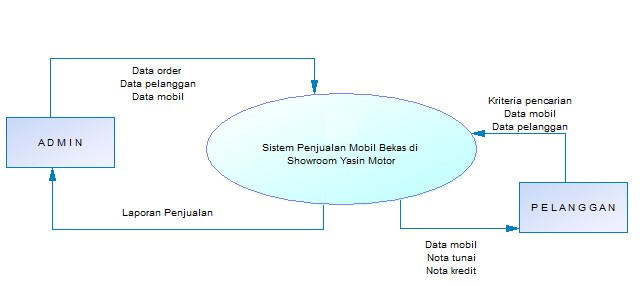

**2.1.2 Level 0**

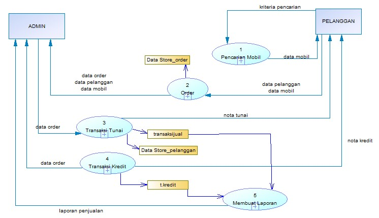

**2.1.3 Level 1 proses 1.0 – pencarian mobil**

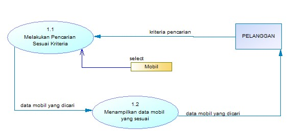

**P-Spec Proses 1.1 “Melakukan Pencarian Sesuai**

**Kriteria”**

Input : idmerk, Tipe, idjenis, warnamobil, tahunproduksi, hargajual, Output :
data mobil yang dicari

Algoritma : Print (Select \* from mobil where kriteria=input)

**2.1.4 Level 1 Proses 2.0 – Order**

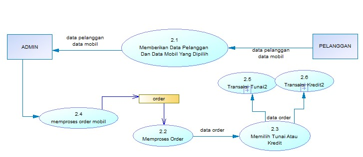

**P-Spec Proses 2.1 “Menerima Data Pelanggan**

**Dan Data Mobil Yang Dipilih”**

| Input kontak | : id\_kendaraan, nama\_pemesan,   |
|--------------|-----------------------------------|
| Output       | : data order                      |
| Algoritma    | : insert into order values(input) |

**2.1.5 Level 1 Proses 3.0 – Transaksi Tunai**

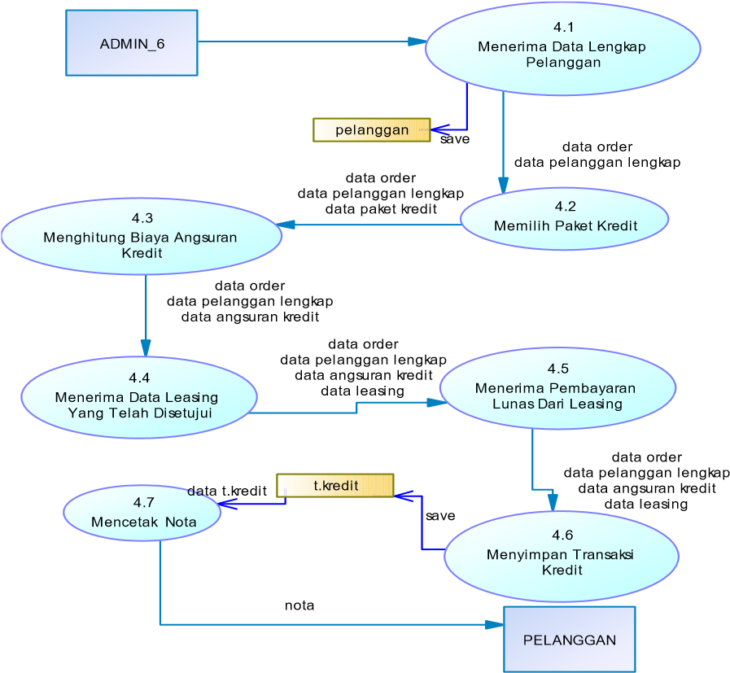

**P-Spec Proses 3.1 “Data Lengkap Pelanggan”** Input : namapelanggan, alamat,
notelp,

noktp, provinsi, kecamatan, kota, pekerjaan

Output : data pelanggan lengkap Algoritma : insert into pelanggan values(input)

**P-Spec Proses 3.4 “Menerima Bukti Pembayaran”**

Input : idtransaksijual

Output : data transaksitunai

Algoritma : update terjual transaksitunai set status=’Lunas’

**2.1.6 Level 1 Proses 4.0 – Transaksi Kredit**

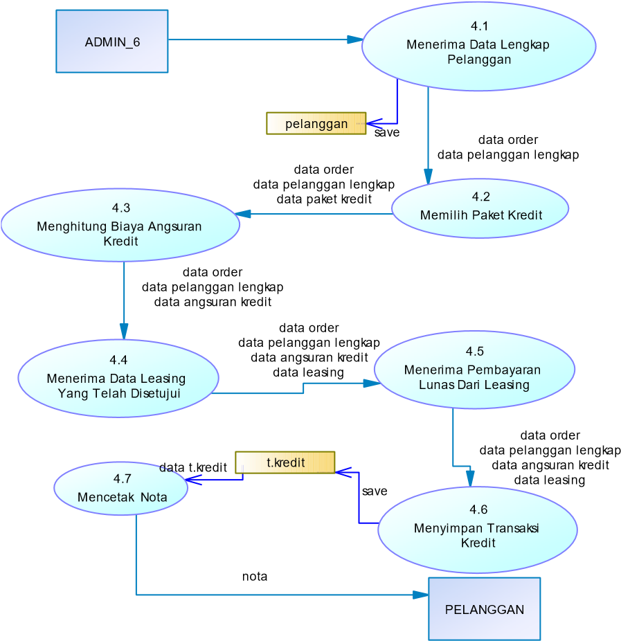

**P-Spec Proses 4.6 “Menyimpan Transaksi Kredit”** Input : idmobiljual,
idpelanggan,

idleasing, angsuran

Output : data t.kredit

Algoritma : insert into t.kredit values(input)

**2.1.7 Level 1 Proses 5.0 – Laporan**

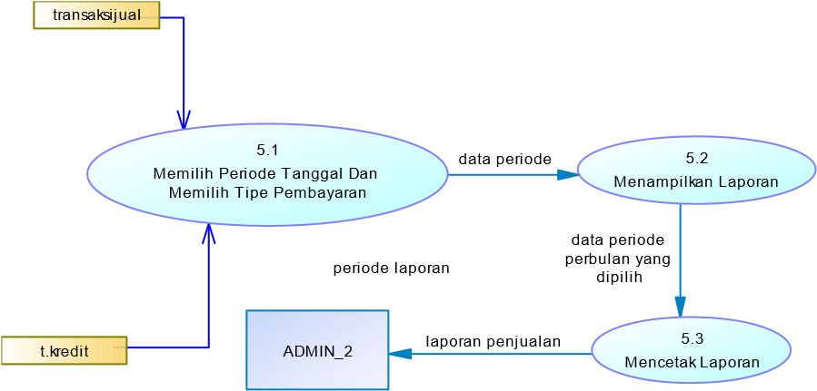

**P-Spec Proses 5.1 “Memilih Periode Tanggal Dan**

**Memilih Tipe Pembayaran”**

Input : tanggal\_mulai, tanggal\_selesai, tipe\_pembayaran

Output : data laporan

Algoritma : if tipe\_pembayaran=tunai then

hasil=select \* from

transaksitunai where tgl between input

else

hasil=select \* from t.kredit

where tgl between input

print (hasil)

**2.1.8 Perancangan Antar Muka**

1.  perancangan menu utama program user admin

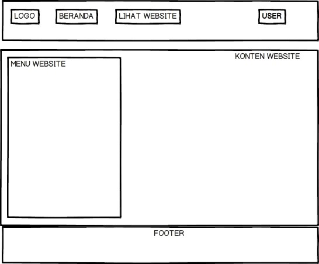

1.  Perancangan form login untuk admin

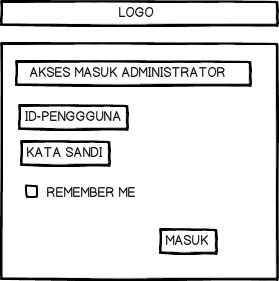

1.  Perancangan form login untuk user

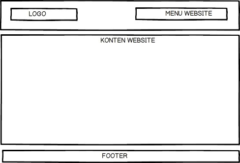

**3.Implementasi**

1.  **Pengujian**

**3.1.1 Hasil Pengujian ( Black Box Testing)**

Hasil tabel pengujian perangkat lunak penjualan mobil bekas dengan menggunakan
metode black box testing

| **N** |
|-------|

>   **o.**

**Fungsi yang diuji**

**Cara**

>   **Pengujian**

**Hasil Yang diharap kan**

**Hasil Penguj ian**

| 1 | Uji domain              | [www.yasinmot](http://www.yasinmotor.co.id/)                                          | Website tampil        | Belum |   |   |
|---|-------------------------|---------------------------------------------------------------------------------------|-----------------------|-------|---|---|
| 2 | Login ke halama n admin | Menginput username dan password yang terdaftar sebagai admin                          | Login Berhasil        | OK    |   |   |
| 3 | Input data mobil        | Klik menu tambah mobil                                                                | Data Mobil Bertamb ah | OK    |   |   |
| 4 | Ubah                    | Klik menu kelola mobil kemudian klik tombol ubah pada data mobil yang ingin di        | Data Berubah          | OK    |   |   |
|   |                         | ubah                                                                                  |                       |       |   |   |
| 5 | Mengh                   | Klik menu kelola mobil kemudian klik tombol hapus pada data mobil yang ingin di hapus | Data terhapus         | OK    |   |   |

>   [or.co.id ](http://www.yasinmotor.co.id/)

>   terealis asi

>   Data

>   Mobil

>   apus Data

>   Mobil

**Tampilan Menu Order Masuk**

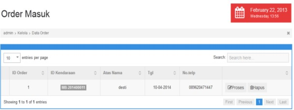

**Tampilan Menu Data Tunai**

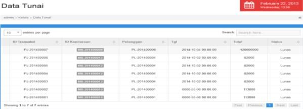

**Tampilan Menu Data Kredit**

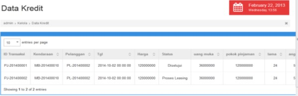

**4.Kesimpulan dan Saran**

**4.1 Kesimpulan**

1.  Dengan adanya perangkat lunak penjualan mobil dapat mengelola data mobil
    untuk melakukan pencatatan secara terkomputerisasi, baik untuk pencatatan
    mobil maupun laporan pengeluaran mobil.

2.  Dengan diterapkannya program Perangkat 3.
    http://glosarium.org/bisnis/online/arti/?k Lunak ini dapat mengurangi
    kendala dalam =showroom [05/05/2014, 08.30] menyimpan data dan menampilkan
    dalam bentuk 4. http://kuliah.dinus.ac.id/edi-nur/sb1-

laporan di bagian arsip. 1.html [05/05/2014, 08.30]

5. http://sukmautama.blogspot.com/2013/0

**4.2 Saran** 1/pengertian-e-commerce.html

>   [05/04/2014, 13.00]

1.  Aplikasi ini dapat dikembangkan menjadi

6. http://nimbus-

>   aplikasi berbasis mobile sehingga dapat
>   sirius.blogspot.com/2012/07/pengertian

mempermudah penggunanya untuk mengakses

>   \-transaksi.html [05/04/2014, 13.00]

aplikasi ini.

1.  Selain itu dapat juga dikembangan dengan menambahkan fitur bahasa seperti
    bahasa inggris

sehingga konsumen yang berasal dari luar negeri

dapat memahami website ini

**DAFTAR PUSTAKA**

1.  Rosa A. S, M Shalahuddin 2013

>   Rekayasa Perangkat Lunak

1.  Yuhefizar, 2013 Membuat Toko Online itu Mudah

2.  Yuhefizar, 2013 Cara Mudah

>   Membangun Website Berbasis CMS Joomla

1.  Deni Sutaji, 2012 Sistem Inventory Mini Market Dengan PHP dan Jquery

2.  http://Fridwaniskandar.files.wordpress.c om

3.  http://www.mystyka.us/2013/10/mobil. html

4.  http://zulidamel.wordpress.com/2007/1
    1/27/transaksi-bukti-transaksi-jurnaldan-posting/

5.  http://dansite.wordpress.com/2009/03/3

>   1/pengertian-persediaan-inventory/

1.  http://cahkos.com/2013/pengertiankomputer/

>   **DAFTAR PUSTAKA LAINNYA**

1.  http://elib.unikom.ac.id/download.php?i d=93051 [05/05/2014, 08.30]

2.  http://elib.unikom.ac.id/download.php?i d=93051 [05/05/2014, 08.30]
