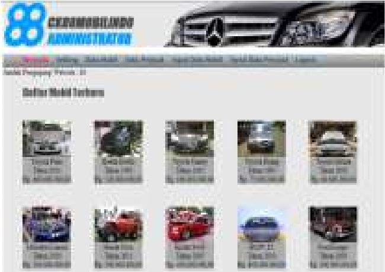

>   **Jurnal Computech & Bisnis,** Vol. 6, No. 1, Juni 2012, 34-39 ISSN
>   2442-4943

SIMULASI KREDIT PEMASARAN MOBIL BEKAS BERBASIS WEB MENGGUNAKAN *CODEIGNITER FRAMEWORK* 
=======================================================================================

Dadi Rosadi1, Purnomo2 
-----------------------

>   **STMIK Mardira Indonesia, Bandung dadi\_rosadi\@stmik-mi.ac.id1**

### *Abstract* 

*As increasing competition between similar products sales, especially four-wheel
vehicles, CK88 Mobilindo which is one of the used car showroom which is located
on Jalan Gatot Subroto no. 225 need to create an innovation and improvement in
the conduct of marketing strategies to increase consumer interest in purchasing
the products offered. Media advertising is a marketing strategy used CK88
Mobilindo showroom in the used car market vehicles offered. To provide better
service to consumers and presents a variety of information to consumers is a
good strategy to attract consumers.*

*In this study, a media tool to meet one of the marketing strategies in the
showroom CK88 Mobilindo. With applications and Simulation Information Systems
Used Car Loan WebBased Marketing is expected to meet the wishes of the showroom
to attract consumers.*

*Keywords: information systems, simulation credit, marketing, CodeIgniter
framework*

Abstrak 
--------

*Seiring semakin ketatnya persaingan antara penjualan produk yang sejenis
khususnya kendaraan roda empat, CK88 Mobilindo yang merupakan salah satu
showroom mobil bekas yang beralamat di jalan Gatot Subroto no. 225 perlu membuat
sebuh inovasi dan improvement dalam melakukan strategi pemasaran untuk
meningkatkan minat pembelian konsumen akan produk yang ditawarkan.*

*Media periklanan merupakan salah stategi pemasaran yang digunakan showroom CK88
Mobilindo dalam memasarkan kendaraan mobil bekas yang ditawarkan. Memberikan
pelayanan yang lebih ke konsumen dan menyajikan berbagai informasi ke konsumen
merupakan strategi yang jitu dalam menarik konsumen.*

*Dalam penelitian ini merupakan media alat bantu untuk memenuhi salah satu
strategi pemasaran di showroom CK88 Mobilindo. Dengan dibuatnya aplikasi Sistem
Informasi dan Simulasi Kredit Pemasaran Mobil Bekas Berbasis Web ini diharapkan
dapat memenuhi keinginan pihak showroom untuk menarik konsumen.*

Kata Kunci: sistem infomasi, simulasi kredit, pemasaran, codeigniter framework

### 34 

>   *Simulasi Kredit Pemasaran Mobil Bekas*

1 PENDAHULUAN 
--------------

Perkembangan ilmu pengetahuan dan teknologi informasi sekarang ini berlangsung
begitu sangat pesat, banyak solusi-solusi yang diciptakan teknologi informasi
dalam membantu meringankan kerja manusia. Tidak sedikit perusahaan saat ini yang
memperoleh keuntungan besar setelah mengoptimal kan pemanfaatan teknologi
informasi baik keuntungan material maupun keuntungan non material.

Seiring dengan perkembangan ilmu pengetahuan dan teknologi informasi,
perdagangan mobil juga berkembang pesat di Indonesia. Hal ini disebabkan karena
mobil pada saat sekarang ini sudah seperti kebutuhan primer, khususnya di
kota-kota besar seperti Bandung. Semua ini dapat dilihat dari meningkatnya daya
beli masyarakat dan meningkatnya permintaan baik mobil baru ataupun mobil bekas
dari tahun ke tahun. Serta dengan didukungnya sistem pembayaran sekarang ini
yaitu sistem kredit yang membuat para konsumen semakin dipermudahkan.

Untuk perusahaan yang memiliki usaha bisnis dalam memperdagangkan mobil seperti
*showroom* mobil bekas, media periklanan merupakan hal yang penting, apalagi
persaingan sekarang ini sangat menjamur di kehidupan masyarakat. Tujuan
menggunakan media internet juga dapat membantu dalam memberikan pengenalan
barang secara tepat tanpa memandang ruang dan waktu. Strategi pemasaran ini
banyak dipakai karena memiliki peran penting dalam dunia bisnis dan memiliki
jangkuan pasar yang luas.

Ditengah persaingan bisnis antar *Showroom* mobil bekas yang semakin ketat,
banyak pihak dari *showroom* yang berusaha meningkatkan efisiensi kerjanya
dengan melakukan komputerisasi dibeberapa ataupun seluruh bagian dalam badan
usahanya, dengan harapan informasi-informasi yang diperoleh dapat lebih teliti
dan akurat sehingga aspek penjualan dapat mencapai tingkat seoptimal mungkin.

Dikarenakan perusahaan ingin memajukan kegiatan bisnisnya dalam menarik para
konsumen, dan konsumen sendiri juga menginginkan informasi mengenai berbagai
produk mobil bekas, serta informasi mengenai sistem pembayaran khususnya sistem
kredit, baik itu informasi mengenai besarnya uang muka yang harus dibayar,
jangka waktu atau tenor pembayaran, ataupun besarnya angsuran, maka saat ini
perusahaan tersebut membutuhkan sebuah aplikasi sistem informasi yang dapat
digunakan untuk membantu pemasaran mobil bekas dengan menggunakan *website*
(Raharjo, Heryanto, & RK, 2012)*.* Dengan sistem *On-line* ini, para konsumen
dapat langsung membaca dan memeriksa serta mempertimbangkan mengenai produk-
produk yang sesuai dengan kebutuhan konsumen itu sendiri (Nugroho, 2004). Jadi
konsumen bisa tahu semua informasi yang disajikan baik dari produk yang
diinginkan maupun informasi sistem kredit dimana semua itu dilakukan secara
*on-line* dengan menggunakan sumberdaya internet berbasis *web*(Rosadi, D., &
Kurniasih,

I., 2011)*.*

### Identifikasi Masalah 

Berdasarkan uraian latar belakang di atas, maka penulis mengidentifikasi
beberapa perma-salahan antara lain :

1.  Bagaimana membangun sebuah aplikasi yang dapat menampilkan berbagai
    informasi kendaraan mobil bekas yang dijual *showroom* mobil bekas.

2.  Menampilkan informasi mengenai simulasi kredit.

3.  Menggali kebutuhan berbagai informasi dari konsumen melalui *contact
    person*.

#### Batasan Masalah 

| **36 Jurnal Computech & Bisnis,** Vol. 6, No. 1, Juni 2012, 34-39 |
|-------------------------------------------------------------------|

Setelah mengidentifikasi masalah, maka dapat dibatasi ruang lingkup dari
permasalahan penelitian tersebut adalah sebagai berikut:

1.  Rancangan web yang akan dibuat berhubungan dengan informasi pemasaran mobil
    bekas.

2.  Dalam aplikasi web ini akan menyajikan informasi tentang stok mobil bekas
    beserta informasi teknis, simulasi kredit, dan konsumen juga dapat
    berkonsultasi ke pihak admin.

3.  Aplikasi ini menggunakan *Codeigniter Framework*

**2. Landasan Teori**

#### 2.1 Pengertian Simulasi 

Simulasi dapat diartikan sebagai meniru suatu sistem nyata yang kompleks dengan
penuh dengan sifat *probabilistik*, tanpa harus mengalami keadaan yang
sesungguhnya. Hal ini dapat dilakukan dengan membuat sebuah miniatur yang
*representative* dan *valid* dengan tujuan *sampling* dan *survey statistik*
pada sistem nyata, sehingga perilaku sistem dapat diprediksi untuk dipelajari
(Nazir, 2005). Jadi simulasi secara sederhana dapat diartikan sebagai proses
peniruan. Simulasi digunakan sebelum sebuah sistem yang ada dibangun (Hariyanto,
2004). Beberapa pendapat tentang definisi simulasi :

>   *“Simulasi adalah tehnik untuk membuat konstruksi model matematika untuk
>   suatu proses atau situasi, dalam rangka menduga secara karakteristik atau
>   menyelesaikan masalah berkaitan dengannya dengan menggunakan*

*model yang diajukan.”*

>   **2.2 Manfaat Simulasi** Adapun manfaatnya adalah :

1.  *To reduce the chance of failure to meet specifications,*

2.  *To eliminate unforeseen bottlenecks,*

3.  *To prevent under or over utilization of resource,*

4.  *To optimize system performance.*

#### 2.3 Kelemahan Simulasi 

1.  Simulasi tidak akurat. Teknik ini bukan proses optimisasi dan tidak
    menghasilkan sebuah jawaban tetap hanya menghasilkan sekumpulan output dari
    sistem pada berbagai kondisi yang berbeda.

2.  Model simulasi sangat mahal Model simulasi yang baik bisa jadi sangat mahal,
    bahkan sering dibutuhkan waktu lama untuk mengembangkan model yang sesuai.

3.  Tidak semua situasi dapat dievaluasi dengan simulasi.

>   Hanya situasi yang mengandung ketidak-pastian yang dapat dievaluasi dengan
>   simulasi. Karena tanpa komponen acak semua eksperimen simulasi akan
>   menghasilkan jawaban yang sama.

1.  Simulasi menghasilkan cara untuk mengevaluasi solusi, bukan menghasilkan
    cara untuk memecahkan masalah. Jadi sebelumnya perlu diketahui dulu solusi
    atau pendekatan solusi yang akan

>   diuji

| *Simulasi Kredit Pemasaran Mobil Bekas* |
|-----------------------------------------|

**2. 4 Kelebihan Simulasi** Tidak semua pengolahan data untuk melihat
karakteristik sistem cocok menggunakan simulasi, hanya sistem yang cukup
kompleks yang baik dikerjakan dengan simulasi, sementara untuk sistem yang
sederhana lebih baik menggunakan cara analitik dibanding harus membuat
simulasinya. Beberapa kelebihan simulasi :

1.  Sistem nyata sulit diamati secara langsung.

2.  Mampu memberikan perkiraan sistem yang lebih nyata sesuai operasional dari
    kumpulan pekerjaan.

3.  Pengamatan sistem secara langsung tidak dimungkinkan karena sangat mahal,
    Memakan waktu yang terlalu lama, akan merusak sistem yang sedang berjalan.

4.  Solusi analitik tidak dapat dikembangkan, karena sistem yang digunakan di
    dunia kerja sangat kompleks. Jadi simulasi dapat memberi solusi apabila
    model *analitik* gagal.

5.  Memudahkan pengontrolan lebih banyak kondisi dari suatu percobaan sehingga
    dimungkinkan untuk dicoba diterapkan secara nyata pada sistem tersebut.

6.  Menyediakan sarana untuk mempelajari sistem dalam waktu yang cukup lama
    (lebih ekonomis) dengan proses yang membutuhkan waktu cukup singkat ataupun
    sebagai alternatif pembelajaran yang lebih rinci dan jelas tentang perilaku
    suatu sistem nyata yang prosesnya lebih panjang.

##### Metode Perhitungan Bunga 

Secara umum ada 2 metode dalam perhitungan bunga dalam kredit yaitu :

1.  **Bunga Flat** Adalah sistem perhitungan bunga yang besarnya bunga mengacu
    pada pokok hutang awal. Dengan menggunakan sistem bunga flat ini maka porsi
    bunga dan pokok hutang dalam angsuran bulanan akan tetap sama. Misalnya
    besar angsuran adalah satu juta rupiah dengan komposisi porsi pokok 750 ribu
    dan bunga 250 ribu. Maka, sejak angsuran pertama hingga terakhir porsinya
    akan tetap sama.

2.  **Bunga efektif** Adalah kebalikan dari sistem bunga flat, yaitu porsi bunga
    dihitung berdasarkan pokok hutang tersisa. Sehingga porsi bunga dan pokok
    dalam angsuran setiap bulan akan berbeda, meski besaran angsuran per
    bulannya tetap sama. Sistem bunga efektif ini biasanya diterapkan untuk
    pinjaman jangka panjang semisal KPR atau kredit investasi.

###### 3. Pembahasan 

**3.1 Analisis Sistem**

###### *A. System Usecase* 

*System Usecase* menerangkan secara rinci aktifitas yang dilakukan bagaimana
seseorang akan menggunakan sistem*. System Usecase* pada sistem adalah seperti
gambar yang tampil dibawah ini :

| **38 Jurnal Computech & Bisnis,** Vol. 6, No. 1, Juni 2012, 34-39 |
|-------------------------------------------------------------------|

##### B. Activity Diagrame 

###### 3.2 Perancangan Sistem 

Tahapan perancangan merupakan tindak lanjut dari tahapan analisis, perancangan
sistem bertujuan untuk memberikan gambaran mengenai sistem yang akan dibangun
secara lebih detail pada teknis pembangunan sistem.

##### A. Diagram Sekuensial Simulasi 

>   [./media/image1.png](./media/image1.png)

B. *Class diagram*

Menggambarkan struktur dan deskripsi *class, package* dan objek beserta hubungan
satu sama lain seperti *containment*, pewarisan, asosiasi, dan lain-lain.

>   [./media/image2.png](./media/image2.png)

###### C. Struktur Tabel Mobil 

>   [./media/image3.jpg](./media/image3.jpg)

###### D. Struktur Menu Halaman Admin 

>   [./media/image4.png](./media/image4.png)

| *Simulasi Kredit Pemasaran Mobil Bekas* |
|-----------------------------------------|

### 4. IMPLEMENTASI 

**5. KESIMPULAN** Kesimpulan yang dapat ditarik berdasarkan rangkaian proses
pembuatan Sistem Informasi dan

### REFERENSI 

Rosadi, D., & Kurniasih, I. (2011). Sistem Pemberkasan Sertifikasi Guru Berbasis
Web. *Jurnal*

>   *Computech & Bisnis*, *5*(2), 5865.

Hariyanto, B. (2004). *Rekayasa Sistem Berorientasi Objek.* Bandung:

>   Informatika.

Nazir, M. (2005). *Metode Penelitian.*

>   Bogor: Ghalia Indonesia.

Simulasi Kredit Pemasaran Mobil Bekas

Berbasis Web Menggunakan CodeIgniter Framework adalah sebagai berikut :

1.  Aplikasi ini merupakan sistem yang bisa memberikan informasi kepada konsumen
    tentang pemasaran mobil bekas.

2.  Aplikasi ini menyajikan dan memberikan informasi kepada konsumen tentang
    sistem pembayaran kredit mobil bekas.

3.  Merupakan sarana bagi pihak *showroom* CK88 Mobilindo untuk menjadikan
    solusi pemasaran bisnis yang dijalankan.

Nugroho, A. (2004). *Pemograman Berorientasi Objek.* Bandung:

>   Informatika.

Raharjo, B., Heryanto, I., & RK, E. (2012). *Modul Prmograman WEB (HTML, PHP, &
MySQL).*

>   Bandung: Modula.
